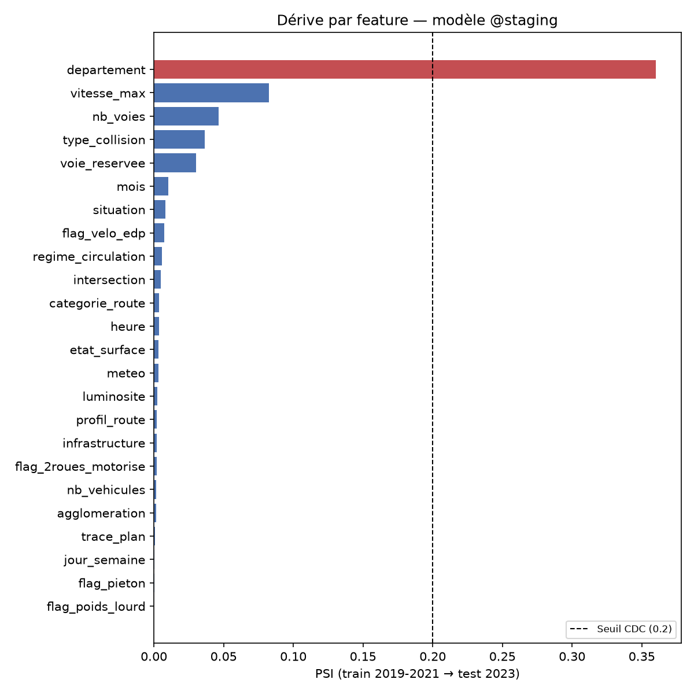

# Avancement du projet GRAVIA

> **But de ce fichier :** permettre de reprendre le projet dans un nouveau chat sans perdre le
> contexte. À mettre à jour à chaque jalon (fin de couche, décision structurante, changement de
> cap) — pas à chaque commit. Le détail du *pourquoi* de chaque décision reste dans
> [CLAUDE.md](../CLAUDE.md) et les docs référencées ; ce fichier ne fait que pointer dessus et
> dire *où on en est*.

**Dernière mise à jour :** 2026-09-13 — dashboard Grafana latence/débit/erreurs de l'API
(`/metrics` instrumenté, `infra/grafana/provisioning/dashboards/`) : dernière promesse de
`Architecture_GRAVIA.md` §9 restée non livrée, désormais faite et vérifiée sur trafic réel.
**Les deux dépôts de la certification sont désormais complets** sur toutes les briques prévues
par le CDC, y compris l'observabilité (ENF-7).

## En une phrase

Le cadrage, l'EDA et les décisions d'architecture sont actés ; le pipeline de données
**Bronze → Silver → Quality → Gold est complet, testé et orchestré par Airflow**, chargé en base
réelle (273 226 accidents, 2019-2023) ; **`ml/features`, `ml/training`, `ml/serving`,
`ml/monitoring` et `ml/fairness` en place** — un modèle (LightGBM enriched) est entraîné,
évalué, enregistré, **servi en temps réel** via une API FastAPI conteneurisée, sa dérive
(features + prédiction) est mesurable et son équité (âge/sexe) est auditée ; **CI (lint + tests)
+ CD (publication d'image, déploiement, réentraînement planifié) automatisées** ; le dépôt
**`gravia-mlops`** a son K8s (`kind`), son Terraform (LocalStack) et son CD faits et vérifiés.
**Reste à faire : rien de structurant** — le projet couvre l'ensemble des briques exigées par le
CDC sur les deux dépôts.

## État par composant

### ✅ Fait

- **Cadrage & gouvernance** — CDC, architecture de données, plan de gouvernance, AIPD et
  présentation Jedha rédigés ([docs/](.)).
- **EDA & décisions produit** (voir [notebooks/README.md](../notebooks/README.md) pour le détail) :
  - Baseline BAAC seul validée : recall 0,808 / F1 macro 0,708 (holdout 2023) — les deux seuils
    CDC sont atteints sans aucun enrichissement.
  - Enrichissement trafic (DATEX national + capteurs Paris) testé en modèle et **écarté** :
    signal statistiquement réel mais gain prédictif nul. Le flux temps réel reste ingéré pour le
    routage des secours, pas pour le modèle.
  - Bulletins d'incidents texte **retirés du périmètre** (aucune source réelle).
  - Angle mort du seuil unique documenté : recall 0,007 sur Paris vs 0,808 national. Seuils par
    département : recall Paris 0,777 mais F1 macro national tombe à 0,573 (sous seuil CDC).
    Meilleure config trouvée (seuils + features enrichies) : recall Paris 0,812 / F1 macro 0,609
    — **tension atténuée, pas résolue**. Point ouvert à trancher avant mise en production
    (CDC §13.7, §14).
- **Infra dev** — stack Docker Compose (MinIO, PostgreSQL, Airflow, MLflow, Redis, Redpanda…),
  projet nommé explicitement `gravia`, dépendances Python figées, cible Python 3.12.
- **Pipeline de données — couche Bronze** ([src/gravia/bronze.py](../src/gravia/bronze.py)) —
  ingestion brute des 4 tables BAAC (caracteristiques, lieux, vehicules, usagers) pour
  2019-2023, tout en `Utf8` sans coercion, écriture Parquet local + upload MinIO, idempotente.
  Gère déjà les pièges de schéma connus (renommage `Accident_Id` en 2022, coquille
  `carcteristiques` 2021/2022). Colonnes de provenance (`_millesime`, `_source_file`,
  `_ingested_at`) pour la traçabilité gouvernance.
- **Décision d'architecture Silver/Gold** — Silver = une table Parquet par entité BAAC
  (caractéristiques/lieux/véhicules/usagers), nettoyée/typée/dédupliquée/pseudonymisée
  **indépendamment, sans jointure inter-table**. Gold fait la jointure (`Num_Acc`, `id_vehicule`)
  et construit `is_grave` + le schéma en étoile. Doc mise à jour en conséquence
  ([Architecture_GRAVIA.md §5](Architecture_GRAVIA.md)) ; la mention d'enrichissement météo/géo en
  Silver a été retirée de ce tableau (jamais implémenté, cf. CLAUDE.md).
- **Dictionnaire officiel BAAC identifié** — [Description des bases de données annuelles
  (ONISR, 21/10/2025)](https://www.onisr.securite-routiere.gouv.fr/sites/default/files/2025-10/Description%20des%20bases%20de%20donn%C3%A9es%20annuelles.pdf),
  référencé dans CLAUDE.md, à vérifier systématiquement pour tout choix de typage Silver/Gold.
  Deux points à retenir : valeurs manquantes sur 3 formats (vide/`0`/`.`, pas seulement `-1`) ;
  l'indicateur « blessé hospitalisé » (`grav=3`, utilisé dans `is_grave`) n'est plus labellisé
  par la statistique publique depuis 2019 et non comparable avant/après 2018.
- **Pipeline de données — couche Silver** ([src/gravia/silver.py](../src/gravia/silver.py)) —
  nettoie les 4 tables Bronze indépendamment (pas de jointure), typage strict vérifié contre le
  dictionnaire ONISR, dédoublonnage `lieux` sur `Num_Acc`. Pseudonymisation : `lat`/`long`
  supprimées (localisation restant disponible via `dep`/`com`, choix documenté car un simple
  arrondi de coordonnées ne garantit pas la non-individualisation RGPD dans les zones peu
  denses) ; `an_nais` remplacé par `tranche_age` (6 tranches), calculé via `_millesime` sans
  jointure vers `caracteristiques`. Testé sur les 5 millésimes réels 2019-2023 (`--no-upload`) :
  taux de nulls faibles et cohérents, codes `catv`/`grav`/`catu` conformes au dictionnaire.
  `is_grave` **n'est pas construit ici**, reporté à Gold.
- **Pipeline de données — couche Gold** ([src/gravia/gold.py](../src/gravia/gold.py), DDL dans
  [data/models/gold_schema.sql](../data/models/gold_schema.sql)) — implémente fidèlement le
  schéma en étoile de [Architecture_GRAVIA.md §4.2](Architecture_GRAVIA.md) (`gold_fact_accident`,
  `gold_dim_date`, `gold_dim_lieu`, `gold_dim_conditions`, `gold_dim_collision`), avec 3 écarts
  assumés et documentés dans le module : `departement` en `VARCHAR` (codes Corse `2A`/`2B` non
  numériques) ; `type_collision` décodé en libellé texte ; les flags véhicule/usager reprennent
  la configuration **réellement validée** dans `notebooks/eval_enrichissement_vs_seuil.py`
  (`flag_2roues_motorise`/`flag_poids_lourd`/`flag_velo_edp`/`flag_pieton`, codes `catv` repris à
  l'identique) plutôt que le `flag_moto` jamais testé du schéma d'origine. `jour_ferie` est un
  enrichissement neuf (jours fériés France métropolitaine, `dateutil.easter`, dépendance figée
  ajoutée), non validé en amont contrairement au reste. Chargé et vérifié sur les 5 millésimes
  réels dans le PostgreSQL du Docker Compose dev : **273 226 accidents** (identique au chiffre du
  protocole baseline CLAUDE.md), taux `is_grave` **35,76 % national pondéré sur 2019-2023**
  (34,60 % à 36,09 % selon le millésime — cohérent avec le ~36 % déjà documenté ; la valeur
  36,09 % citée dans une version précédente de ce fichier était en réalité le taux 2023 seul, pas
  la moyenne pondérée des 5 ans), zéro clé étrangère orpheline, rechargement testé idempotent.
  **Bug trouvé et corrigé en testant Gold** : chaque fichier BAAC source contient une ligne
  finale entièrement vide (artefact d'export) que Silver ne filtrait pas encore — corrigé dans
  `silver.py` (`Num_Acc` non nul), Silver régénéré, Bronze inchangé (fidélité à la source).
  Documenté dans CLAUDE.md, pièges de schéma BAAC.
  **Écart structurel trouvé en préparant `ml/features`, corrigé** : `gold_dim_lieu` ne portait
  que 4 attributs (`departement`/`agglomeration`/`categorie_route`/`vitesse_max`) — 8 attributs
  utilisés par le baseline déjà validé manquaient (`circ`, `nbv`, `vosp`, `prof`, `plan`, `infra`,
  `situ` côté lieu ; `int`/intersection côté caracteristiques), rendant Gold structurellement
  incapable de le reproduire. Étendu à 12 attributs dans `gold_dim_lieu` (DDL + `gold.py` +
  [Architecture_GRAVIA.md §4.2](Architecture_GRAVIA.md)), schéma recréé et rechargé sur les 5
  millésimes réels : mêmes comptes qu'avant (273 226 accidents, 35,76 % `is_grave` — la
  correction ajoute des features, ne change pas le label).
  **Deuxième bug trouvé au passage** : `create_schema` découpait le DDL sur `;`, mais les
  commentaires SQL du fichier contiennent eux-mêmes des `;` (ex. `-- -1 = non renseigné ;
  lieux.circ`) — coupait en plein milieu d'une instruction. Corrigé pour découper sur `;` suivi
  d'une fin de ligne, seul un vrai terminateur d'instruction dans ce fichier.
- **Suite de tests** (`tests/unit/test_bronze.py`, `test_silver.py`, `test_gold.py`,
  `tests/integration/test_gold_postgres.py`) — 26 tests, **90 % de couverture** (seuil CLAUDE.md :
  80 %). Les tests unitaires n'ont besoin d'aucune infra (fichiers temporaires uniquement) ; le
  test d'intégration Gold est ignoré (`pytest.skip`) si PostgreSQL n'est pas joignable, et nettoie
  ses propres données de test (millésime factice 1900) pour ne pas polluer la base dev partagée.
  **Bug trouvé en écrivant les tests, corrigé** : `cast_columns` castait `" -1"` (sentinelle BAAC
  avec espace de tête, présente sur la quasi-totalité des colonnes codées, pas seulement
  `grav`/`catv`/`catu`) en `null` plutôt qu'en `-1` — `str.strip_chars()` manquant avant le cast.
  Silver et Gold régénérés après correction ; les totaux `is_grave` sont restés identiques (la
  distinction -1/null n'affectait pas ce calcul précis), mais la distinction « valeur explicitement
  codée non-renseigné » vs « valeur réellement absente » est désormais correcte pour tout usage
  futur (Great Expectations, ml/features). Documenté dans CLAUDE.md.
- **Orchestration Airflow** ([pipelines/airflow/dags/etl_medallion_dag.py](../pipelines/airflow/dags/etl_medallion_dag.py))
  — un groupe de tâches par millésime (`bronze` → `silver` → `gold`), TaskFlow API Airflow 3
  (`airflow.sdk`), déclenchement manuel (`schedule=None`, millésimes publiés annuellement).
  A nécessité une image Airflow custom ([infra/airflow/Dockerfile](../infra/airflow/Dockerfile)) :
  l'image officielle `apache/airflow:3.3.0` tourne en Python 3.13, incompatible avec
  `requires-python = ">=3.12,<3.13"` — bascule sur le tag `3.3.0-python3.12`. Seul un
  sous-ensemble des dépendances du projet y est installé (`polars`, `pyarrow`, `sqlalchemy`,
  `psycopg2-binary`, `boto3`, `python-dotenv`, `python-dateutil`) : installer la liste complète de
  `pyproject.toml` (testé, puis abandonné) écrase les versions internes d'Airflow lui-même
  (`fastapi<0.137` requis par son API server vs `fastapi==0.140.0` du projet). Le code applicatif
  n'est pas copié dans l'image : il reste monté en volume (`PYTHONPATH=/opt/airflow/src`) pour que
  les DAGs voient les modifications locales sans reconstruire l'image. `.dockerignore` ajouté au
  passage — le contexte de build sans lui aurait embarqué `data/` (34 Go) et `.venv/` (1,5 Go).
  **Vérifié** : `airflow dags test etl_medallion_baac` exécute les 15 tâches (5 millésimes × 3
  couches) avec succès en ~82 s ; les données rechargées restent identiques (273 226 accidents,
  35,76 % `is_grave`) — l'orchestration ne modifie pas les résultats déjà validés en CLI manuel.
- **Feature engineering ML** ([ml/features/gold_features.py](../ml/features/gold_features.py))
  — charge le schéma en étoile Gold déjà joint depuis PostgreSQL, type pour un modèle
  (catégorielles en `Categorical`, numériques en `Float64`), split temporel anti-leakage train
  2019-2021 / validation 2022 / test 2023 (codé en dur, dévier casserait la comparabilité avec
  les chiffres de référence). Trois groupes de colonnes distincts plutôt que tout mélanger :
  `BASELINE_*` (protocole d'origine, renommé aux noms Gold), `ENRICHED_FLAG_COLUMNS` (meilleure
  config déjà testée), `UNVALIDATED_*` (`weekend`/`jour_ferie`/`nb_usagers`, disponibles dans
  Gold mais jamais testés dans aucun notebook — à comparer au protocole avant adoption, pas à
  utiliser d'office). **Vérifié en reproduisant le protocole complet** (LightGBM + seuil calibré
  sur validation, cf. `notebooks/eda_baseline_baac.py`) sur la sortie de ce module : recall 0,807
  / F1 macro 0,707 contre 0,808/0,708 publiés — reproduction à 0,001 près, seuil calibré identique
  (0,44). **Piège Polars réel trouvé en testant** : caster un entier directement en `Categorical`
  traite sa valeur comme un code de catégorie interne (doit être positif) et non comme un
  libellé — `-1` (sentinelle omniprésente dans ces colonnes) fait échouer le cast. Corrigé en
  passant par `Utf8` d'abord. `ml/` ajouté à la couverture de tests suivie (`pyproject.toml`).

- **Entraînement / benchmark de modèles** ([ml/training/benchmark.py](../ml/training/benchmark.py),
  résultats détaillés dans [docs/ml_training_results.md](ml_training_results.md)) — benchmark 3
  familles de modèles comme prévu par
  [Architecture_GRAVIA.md §3](Architecture_GRAVIA.md) (régression logistique, Random Forest,
  LightGBM ; XGBoost non ajouté — le document cite « LightGBM/XGBoost » comme alternative, pas
  les deux), chacune trackée comme un run MLflow (params, métriques, modèle). Sélection du
  meilleur modèle : priorité au recall (coût asymétrique, cf. CDC), F1 macro en second critère.
  Seul un modèle franchissant les deux seuils CDC (recall ≥ 0,80, F1 macro ≥ 0,70) est enregistré
  dans le registry MLflow, à l'alias `staging` (les stages Staging/Prod sont dépréciés depuis
  MLflow 2.9, remplacés par des alias — traduction de « registry Staging/Prod » de
  l'architecture). **Vérifié en conditions réelles** (MLflow + PostgreSQL du Docker Compose dev,
  273 226 accidents) : logistic_regression recall=0,804/F1=0,695 (sous seuil), random_forest
  recall=0,801/F1=0,690 (sous seuil), **lightgbm recall=0,807/F1=0,707 (OK)** — cohérent avec la
  vérification manuelle précédente. LightGBM v1 enregistré et rechargé avec succès
  (`mlflow.lightgbm.load_model`), prédictions vérifiées correctes.
  **Deux problèmes réels trouvés en testant, corrigés :**
  - `.env` définit déjà `AWS_ACCESS_KEY_ID`/`AWS_SECRET_ACCESS_KEY=test` pour LocalStack/Terraform
    (chargées par `gravia.config` au démarrage) — MLflow/boto3 lisent les mêmes noms de variable
    pour l'artifact store S3 (MinIO), avec des identifiants différents. Un `setdefault` ne les
    remplaçait jamais ; corrigé en les écrasant explicitement dans le process (n'affecte ni
    `.env` ni le shell appelant).
  - Le chemin de service générique de MLflow (auto-validation `pyfunc`, scoring REST JSON) perd
    le dtype `category` pandas des colonnes catégorielles au round-trip JSON, ce que LightGBM
    refuse ensuite (`categorical_feature do not match`). Le modèle n'est pas cassé — chargé
    nativement avec le dtype `category` remis explicitement, il prédit normalement (vérifié). **À
    retenir pour `ml/serving`** : charger via `mlflow.lightgbm.load_model`, pas via le scoring
    REST générique.
  30 tests unitaires + 10 tests d'intégration (dont un contre MLflow réel sur données
  synthétiques, ~12s, isolé du registry réel via des noms de test supprimés en sortie) : 82 % de
  couverture globale (seuil CLAUDE.md : 80 %).
  **Config `enriched` testée aussi** (2026-08-27, cf. [ml_training_results.md](ml_training_results.md)) :
  cette fois les **3 modèles** franchissent les seuils CDC ; LightGBM enriched (F1 macro 0,727)
  bat le LightGBM baseline (0,707), reproduit la config C de
  `notebooks/eval_enrichissement_vs_seuil.py` à 0,002 près. **Promu à l'alias `staging`**
  (`gravia-severity-classifier` v2, décision explicite de l'utilisateur) — rechargé et revérifié
  après promotion (`mlflow.lightgbm.load_model`, prédictions correctes). v1 (baseline) reste dans
  le registry comme historique, accessible via `models:/gravia-severity-classifier/1`.
- **Serving** ([ml/serving/](../ml/serving/), image [infra/serving/Dockerfile](../infra/serving/Dockerfile))
  — `POST /v1/predict-severity` (CDC EF-5) charge le modèle `@staging` une fois au démarrage
  (`lifespan`), pas à chaque requête. Réponse conforme à EF-4/EC-8 : probabilité + décision
  binaire au seuil calibré (récupéré depuis les métriques du run MLflow associé, pas recalculé)
  + explication SHAP (`shap.TreeExplainer`, top 5 contributions). `GET /health` pour le
  healthcheck Docker. Journalisation des prédictions (EF-7) en logs structurés — pas encore un
  stockage persistant/interrogeable. Le endpoint **assiste, ne décide pas** (EC-7,
  human-in-the-loop) : aucune action de dispatching déclenchée.
  **Vérifié en conteneur réel** (`docker compose build/up serving`, pas seulement `TestClient`) :
  `/health` et `/v1/predict-severity` répondent correctement, prédiction cohérente avec le
  domaine (impliquer un 2-roues pousse vers « grave », `departement` reste la feature la plus
  influente).
  **Performance sous charge réellement testée** (détail complet dans
  [docs/serving_performance.md](serving_performance.md) —
  [tests/performance/load_test_serving.py](../tests/performance/load_test_serving.py),
  requêtes HTTP concurrentes, pas un aller-retour séquentiel en process) — un premier test
  séquentiel (une requête à la fois) avait affiché p95 = 16 ms, une évaluation **trompeuse** :
  sous charge concurrente réelle, un seul worker uvicorn (config d'origine) sérialisait tout,
  débit plafonné à ~65 req/s quelle que soit la concurrence, **p95 = 424 ms dès 25 requêtes
  simultanées — sous le seuil CDC ENF-1 (< 300 ms)**. Corrigé en passant à 4 workers uvicorn
  (`infra/serving/Dockerfile`, un par cœur logique disponible n'était pas nécessaire pour ce
  volume) : débit ~3-4× meilleur (≈210-227 req/s), **p95 repasse sous 300 ms jusqu'à ~25-40
  requêtes simultanées** ; à 50 requêtes simultanées c'est tout juste à la limite (p95≈301 ms,
  max 416 ms) — capacité réelle du conteneur dev actuel, pas un chiffre théorique. Script de
  charge gardé dans le dépôt (pas un `test_*.py` pytest — trop lent pour tourner à chaque commit)
  pour pouvoir rejouer cette vérification, pas seulement s'y fier une fois.
  **Quatre problèmes réels trouvés en construisant/chargeant l'image Docker, corrigés :**
  - `statsmodels` (tiré transitivement par `evidently`, un outil de monitoring sans rapport avec
    le serving) a besoin d'une chaîne de compilation absente de l'image `python:3.12-slim`.
    Exclu `great-expectations`/`evidently` du serving (deny-list, pas allow-list — aucun conflit
    de versions à éviter ici contrairement à `infra/airflow/Dockerfile`).
  - LightGBM (binaire précompilé) a besoin de `libgomp1` (runtime OpenMP), absent de l'image
    slim — `OSError: libgomp.so.1` au démarrage. Ajouté via `apt-get install libgomp1`.
  - Le serveur MLflow rejette par défaut les requêtes dont l'en-tête `Host` ne correspond pas à
    `localhost`/IP privée (protection anti-DNS-rebinding, MLflow ≥ 2.x) — le nom de service
    Docker Compose `mlflow` ne matchait pas. Corrigé via `--allowed-hosts` sur le serveur MLflow
    lui-même (`infra/docker-compose.yml`), pas seulement côté serving : ça aurait aussi bloqué
    tout futur appel MLflow depuis Airflow.
  - Un seul worker uvicorn (config d'origine) sérialise les requêtes derrière le GIL sous charge
    concurrente — invisible en test séquentiel, trouvé seulement en testant avec de vraies
    requêtes concurrentes (cf. ci-dessus). Corrigé en passant à `--workers 4`.
  `_configure_s3_artifact_env` déplacée de `ml/training/benchmark.py` (fonction « privée ») vers
  un nouveau module partagé `ml/mlflow_env.py` : `ml/serving` en avait besoin aussi, importer un
  nom `_privé` d'un autre module n'aurait pas été propre.
  19 tests supplémentaires (unitaires + intégration contre le vrai modèle `@staging`) : 86 % de
  couverture globale.

- **Pipeline de données — couche Monitoring** ([ml/monitoring/drift.py](../ml/monitoring/drift.py))
  — deux dérives mesurées séparément avec Evidently (`DataDriftPreset(method="psi")`, la même
  métrique que celle citée par le CDC, pas une implémentation maison) :
  1. **Dérive des features** : chaque colonne du modèle `@staging`, train 2019-2021 (référence) vs
     test 2023 (le seul millésime « nouveau », jamais entraîné dessus, disponible à ce jour —
     proxy réel en attendant 2024, cf. « Pistes à évaluer plus tard »).
  2. **Dérive de la prédiction** : distribution des probabilités prédites, validation 2022 vs test
     2023 — détecte une dégradation du modèle même sans nouvelle vérité terrain.
  Vérifié sur les vraies données Gold et le vrai modèle `@staging` : sur 24 features, une seule
  dépasse le seuil CDC (PSI < 0,2) — `departement`, PSI = 0,360 (à investiguer : cardinalité
  élevée d'une variable catégorielle, ~100 modalités, gonfle mécaniquement le PSI cumulé — pas
  nécessairement un vrai changement de fond ; lien possible avec l'angle mort du seuil unique déjà
  documenté). Aucune dérive de prédiction (PSI = 0,001). Script à lancer à la main (pas un
  `test_*.py` pytest, même famille que `tests/performance/*`) : résultat dépendant des données
  réelles, pas une assertion CI. 3 tests unitaires (logique pure, aucune infra) + 1 test
  d'intégration (contre PostgreSQL + MLflow réels).

  

  *Généré par [`docs/generate_result_charts.py`](generate_result_charts.py).*

- **Pipeline de données — couche Quality** ([src/gravia/quality.py](../src/gravia/quality.py)) —
  Great Expectations valide **Silver**, pas Bronze (fidélité brute) ni Gold (déjà en aval), même
  frontière que le diagramme d'architecture (`S -.qualité.-> GE`). Câblée dans le DAG Airflow entre
  `silver` et `gold` (`pipelines/airflow/dags/etl_medallion_dag.py`). Jeux de valeurs autorisées
  **constatés empiriquement sur les 5 millésimes réels** (pas recopiés à l'aveugle du dictionnaire
  ONISR) : formalisent en expectations exécutables les pièges de schéma BAAC déjà documentés en
  prose (sentinelle `-1`, `id_usager` absent avant 2021 — géré en conditionnant l'expectation à la
  présence de la colonne dans le batch). `vma`/`nbv` (lieux) tolèrent 0,1 % de valeurs aberrantes
  (`mostly=0,999`) : 64 lignes sur 273 226 portent une vitesse de 300-901 km/h, bruit de saisie
  déjà présent dans la source BAAC. Vérifié sur les 5 millésimes réels : 20/20 tables conformes.
  Image Airflow reconstruite avec `great-expectations` ajouté au sous-ensemble de dépendances ETL
  (`infra/airflow/Dockerfile`) ; import et exécution vérifiés dans le conteneur réel. 5 tests
  unitaires (dont un cas d'échec provoqué délibérément) + 1 test d'intégration (contre le vrai
  Silver local).

- **Fix Airflow — connectivité tâche → apiserver et `tasks test`**
  ([infra/docker-compose.yml](../infra/docker-compose.yml),
  [src/gravia/bronze.py](../src/gravia/bronze.py) et 3 autres modules `gravia.*`) — deux bugs
  préexistants découverts en vérifiant le DAG complet en conditions réelles, corrigés séparément
  de la couche Quality (reproduits à l'identique sur `bronze`/`silver`, jamais modifiées) :
  1. Sans `AIRFLOW__CORE__EXECUTION_API_SERVER_URL`, chaque tâche appelait son API d'exécution
     sur son défaut codé en dur (`http://localhost:8080/execution/`), valide seulement si
     apiserver et exécuteur de tâche partagent le même conteneur — ici scheduler et
     `airflow-apiserver` sont deux conteneurs séparés : `httpcore.ConnectError` sur toute tâche
     en quelques secondes. Corrigé en pointant explicitement vers `airflow-apiserver:8080`.
  2. `airflow tasks test` enveloppe `stdout` dans `RedactedIO`, qui ne délègue pas
     `.reconfigure()` : `AttributeError` sur tout module `gravia.*` appelant
     `sys.stdout.reconfigure(encoding="utf-8")` au niveau module (encodage console Windows, cf.
     CLAUDE.md). Rendu défensif (`hasattr`) dans `bronze.py`/`silver.py`/`gold.py`/`quality.py`.
  Vérifié par un vrai `airflow dags trigger` complet (**20/20 tâches en succès**, 5 millésimes
  × bronze/silver/quality/gold, ~41 s) et par `tasks test` sur chacune des 4 tâches — **le DAG
  complet tourne désormais de bout en bout pour la première fois avec ce suivi.**

- **CI GitHub Actions** ([.github/workflows/ci.yml](../.github/workflows/ci.yml)) — deux jobs,
  `lint` (`ruff check .` + `black --check .`) et `test` (`python -m pytest --cov`), sur push/PR
  vers `main`. `notebooks/` exclu du lint (`pyproject.toml`, `extend-exclude`) : exploration,
  jamais soumise à ruff/black jusqu'ici — l'y astreindre aurait reformaté 8 scripts d'analyse déjà
  validés, sans rapport avec l'ajout de la CI.
  **Portée volontairement limitée** : les tests d'intégration (PostgreSQL/MLflow/MinIO réels) se
  `pytest.skip()` proprement en l'absence de la stack dev (vérifié en simulant l'environnement CI
  en local : `DATABASE_URL`/`MLFLOW_TRACKING_URI` pointés vers un port injoignable → 53 tests
  passent, 6 se skippent proprement, aucun blocage). Conséquence directe : la couverture mesurée
  en CI (~73 %) est **sous le seuil CDC de 80 %**, contrairement à la couverture réelle du projet
  (84 % avec la stack complète démarrée, cf. jalon `ml/serving`) — un seuil bloquant appliqué ici
  serait trompeur. La couverture est donc affichée en information (`--cov-report=term-missing`),
  pas imposée comme gate ; le seuil CDC reste vérifié en local avec la stack complète, comme
  pratiqué depuis le début du projet. Monter Postgres/MLflow/MinIO en services CI pour lever cette
  limite reste une piste, pas traitée ici (complexité jugée disproportionnée pour l'instant).

- **Tests d'équité du modèle** ([ml/fairness/audit.py](../ml/fairness/audit.py), CDC EC-6 :
  « parité selon âge/sexe, equalized odds ») — [docs/model_fairness.md](model_fairness.md) pour
  le détail complet. Attribut sensible : le conducteur (`catu == 1`), **limité aux accidents à
  un seul conducteur identifié** (38 % du test 2023, 20 830/54 822 — la majorité des accidents
  impliquent plusieurs véhicules donc plusieurs conducteurs, sans façon non arbitraire de n'en
  retenir un seul ; retenir le blessé le plus grave aurait biaisé le test en sélectionnant sur
  l'issue évaluée). Deux résultats réels, opposés :
  - **Par sexe** : parité quasi parfaite (écart de rappel 0,007, écart de FPR 0,019).
  - **Par tranche d'âge** : rappel homogène, mais **écart de FPR de 0,191** — conducteurs mineurs
    (0-17, FPR=0,584) et seniors (65+, FPR=0,500) sur-signalés « grave » à tort près de deux fois
    plus souvent que les 25-34 ans (FPR=0,393). Cohérent avec un taux de gravité réelle plus
    élevé pour ces tranches, mais le modèle **amplifie** l'écart au-delà du taux réel.
  **Aucun seuil pass/fail imposé** (le CDC n'en fixe pas pour l'équité, contrairement à
  PSI/recall/F1/couverture) : le biais par âge est documenté comme tension non résolue à
  arbitrer avant production, dans l'esprit de l'angle mort déjà documenté du seuil unique par
  département — pas corrigé dans cette itération. 5 tests (4 unitaires, logique pure ; 1
  intégration contre le vrai modèle `@staging`).

- **Fix MLflow — `host.docker.internal` dans `--allowed-hosts`**
  ([infra/docker-compose.yml](../infra/docker-compose.yml)) — découvert en déployant `serving`
  sur un cluster K8s local (`kind`, cf. le dépôt
  [`gravia-mlops`](https://github.com/VigiRoute/gravia-mlops)) : un Pod hors du réseau
  docker-compose joint MLflow via `host.docker.internal`, publié sur l'hôte, mais ce nom n'était
  pas dans la liste des hôtes autorisés — même 403 « Invalid Host header » que le fix
  `--allowed-hosts` déjà documenté ci-dessus, cause différente. Chaque Pod crashait au démarrage
  en tentant de charger le modèle `@staging` avant ce fix.

- **Dépôt `gravia-mlops`** — complet : K8s, Terraform et CD faits et vérifiés. Détail complet
  dans le dépôt lui-même (`gravia-mlops/CLAUDE.md`) :
  - **K8s** : manifests de déploiement du `serving` (Deployment/Service/ConfigMap/Secret),
    vérifiés sur un vrai cluster local (`kind`, choisi car LocalStack Community ne supporte même
    pas ECR) — scaling et auto-guérison testés en conditions réelles.
  - **Terraform** : un module par responsabilité (network/storage/compute/mlops, cf.
    `Architecture_GRAVIA.md` §6.2). Constaté en interrogeant l'API LocalStack directement :
    **ECR et RDS sont réservés à la licence Pro** (403 "not included within your LocalStack
    license"), seuls S3/IAM/EC2/KMS/STS/Secrets Manager sont gratuits — les ressources RDS/ECR/
    EKS restent écrites (exigence CDC d'une architecture AWS documentée) mais conditionnées
    (`var.include_pro_only_services`, jamais activée contre LocalStack). 14 ressources créées et
    vérifiées individuellement via `awslocal` (pas seulement l'état Terraform) ; idempotence
    confirmée.
  - **CD** — deux moitiés, "construire" côté `gravia` (`publish-serving-image.yml`, publie
    `ghcr.io/vigiroute/gravia-serving` sur GHCR à chaque push pertinent sur `main`) et "déployer"
    côté `gravia-mlops` (`deploy.yml`, deux jobs indépendants vérifiés en conditions réelles dans
    le runner : `terraform-apply` contre LocalStack, `k8s-deploy` sur un cluster `kind` réel avec
    l'image récupérée depuis GHCR). Package GHCR privé (dépôts privés) : accès cross-repo réglé
    via liaison manuelle du package à `gravia-mlops` (Manage Actions access, pas d'API pour ça).
    Deux vrais bugs trouvés et corrigés en testant : une erreur de syntaxe YAML (deux-points non
    protégés dans une commande `sed`, cassant le parsing) et le même piège de retries MLflow déjà
    rencontré côté tests (`MLFLOW_HTTP_REQUEST_MAX_RETRIES`), ici sur le cluster `kind` du CD.
  - **Réentraînement planifié** (CDC EF-6) — `gravia/.github/workflows/retrain.yml` (pas
    `gravia-mlops` : appelle directement `ml.training.benchmark`, pas de checkout cross-repo
    nécessaire). Vérifie réellement la joignabilité de MLflow/PostgreSQL avant de lancer
    l'entraînement plutôt que de le supposer — s'arrête proprement si l'infra manque (aucune
    stack dev persistante sur ce runner éphémère), au lieu de planter. Déclencheur : `schedule`
    trimestriel (filet de sécurité) + `workflow_dispatch` manuel — le vrai déclencheur visé par
    le CDC (nouveau millésime, dérive détectée) reste événementiel, pas calendaire.

- **Dashboard Grafana — latence/débit/erreurs de l'API** (`infra/grafana/provisioning/`) —
  demandé en amont de la préparation des vidéos de démonstration (CDC §15) : Grafana n'avait
  jamais eu de dashboard construit (seule la source de données Prometheus était branchée),
  malgré la promesse déjà écrite dans `Architecture_GRAVIA.md` §9 ("Grafana : tableaux de bord +
  alertes — latence p95, taux d'erreur, disponibilité"). `ml/serving/api.py` instrumenté
  (`prometheus-fastapi-instrumentator==8.1.0`, endpoint `/metrics`) — la cible Prometheus
  `gravia-api` (déjà déclarée dans `infra/prometheus/prometheus.yml` mais jamais servie) passe
  réellement à `up`. Dashboard provisionné automatiquement (6 panels : p50/p95 vs seuil CDC
  ENF-1 300 ms, débit par endpoint, taux d'erreur, total requêtes, disponibilité).
  **Vrai bug trouvé et corrigé en testant** : après le premier redémarrage, Grafana a totalement
  refusé de démarrer (`Datasource provisioning error: data source not found`) — la source de
  données existait déjà dans le volume persistant depuis des semaines avec un UID auto-généré,
  en conflit avec le `uid: prometheus` fixé dans la nouvelle configuration provisionnée. Corrigé
  en purgeant le volume Grafana (jetable, aucun dashboard/utilisateur manuel à préserver), pas en
  éditant la base SQLite interne à la main. Vérifié de bout en bout sur trafic réel : requêtes
  générées contre l'API → visibles dans `/metrics` → scrapées par Prometheus → interrogeables via
  le proxy Grafana (p95 mesuré ≈ 95 ms, largement sous le seuil CDC).

- **Fix Airflow — identifiants "admin/admin" jamais fonctionnels** (`infra/docker-compose.yml`,
  `Makefile`) — trouvé en auditant la stack après le fix précédent (401 constaté en se
  connectant). `airflow-init` exécutait `airflow users create --username admin --password admin`
  (commande FAB), avalée silencieusement par `|| true` : Airflow 3.x utilise **SimpleAuthManager**
  par défaut, pas FAB (confirmé : `AttributeError: 'AirflowSecurityManagerV2' object has no
  attribute 'get_all_users'`). SimpleAuthManager génère un mot de passe aléatoire par
  utilisateur, imprimé une seule fois dans les logs au premier démarrage, sans moyen de le figer
  (vérifié dans `simple_auth_manager.py` : `_generate_password()` utilise `secrets`
  inconditionnellement). En dev local mono-poste, désactive l'authentification
  (`AIRFLOW__CORE__SIMPLE_AUTH_MANAGER_ALL_ADMINS: "true"`) plutôt que de suivre un mot de passe
  changeant à chaque recréation du volume Postgres. Vérifié : `curl http://localhost:8080/api/v2/dags`
  répond `200` sans aucun header d'auth.

- **Fix `gravia-mlops` CD — image K8s déployée par tag mutable `:latest`**
  (`gravia-mlops/.github/workflows/deploy.yml`) — trouvé au même audit : `k8s-deploy` déployait
  `ghcr.io/vigiroute/gravia-serving:latest` tel quel, en contradiction directe avec la règle du
  projet (« images Docker en tag précis, jamais `latest` », cf. CLAUDE.md) — alors que `gravia`
  publie déjà un tag immuable (`:${{ github.sha }}`). **Première approche testée et rejetée** :
  déployer directement par référence `repo@sha256:...` — `kind load docker-image` sur une
  référence par digest n'est pas reconnue par le kubelet comme « déjà présente »
  (`imagePullPolicy: IfNotPresent`), le Pod tentait un vrai pull du package GHCR privé (sans
  `imagePullSecrets`) et finissait en `ImagePullBackOff` (constaté sur un run réel). Corrigé en
  retaguant localement l'image avec un tag dérivé de son digest (`sha-<12 premiers caractères>`) :
  garde le comportement local-only déjà éprouvé de `:latest`, tout en étant aussi immuable qu'un
  digest. Vérifié par deux runs `workflow_dispatch` réels sur la branche du fix.

## Pistes à évaluer plus tard

- **Étendre le nombre de millésimes d'entraînement.** 2024 est publié sur data.gouv.fr (mêmes
  noms de fichiers que 2023, déjà gérés par `bronze.py`), donc faisable techniquement. Mais avant
  de s'y lancer, à trancher : (1) **combien d'années** utiliser pour le train sans dégrader la
  pertinence du signal (le BAAC change de convention chaque année — cf. CLAUDE.md, pièges de
  schéma — donc « plus » n'est pas gratuit : chaque nouveau millésime ajouté doit être vérifié
  comme les précédents) ; (2) **si c'est réellement utile** — le baseline atteint déjà les deux
  seuils CDC avec 5 ans (273 226 accidents), donc établir d'abord si le facteur limitant actuel
  est la quantité de données ou autre chose (features, angle mort du seuil unique) avant d'investir
  dans l'ingestion. Décalé au train (2019-2022) ou ajouté au holdout changerait aussi le protocole
  de référence déjà cité partout (CLAUDE.md, ce fichier, `ml_training_results.md`) — à documenter
  explicitement plutôt qu'à faire glisser silencieusement.

## Prochaine étape probable

**Aucune brique structurante ne reste à construire.** Les deux dépôts couvrent l'ensemble du
CDC : pipeline de données (Bronze→Silver→Quality→Gold, Airflow), solution IA (features,
entraînement, serving, monitoring de dérive, équité), CI/CD des deux dépôts, IaC (Terraform/
LocalStack), K8s (`kind`) et réentraînement planifié. Les suites possibles à partir d'ici
relèvent de la finition (présentation orale, vidéos de démonstration exigées par le CDC §15,
relecture globale de la documentation) plutôt que de nouvelles fonctionnalités — à discuter avec
l'utilisateur plutôt qu'à décider seul.

## Comment relancer le contexte dans un nouveau chat

1. Ce fichier donne le *où on en est*.
2. [CLAUDE.md](../CLAUDE.md) donne les règles, conventions et pièges à ne pas re-découvrir.
3. `git log --oneline -20` donne l'activité récente réelle (source de vérité si ce fichier a
   pris du retard).
