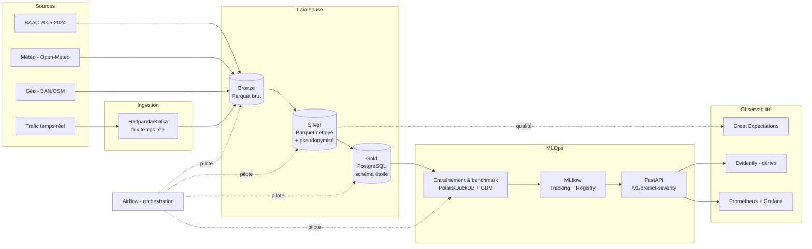
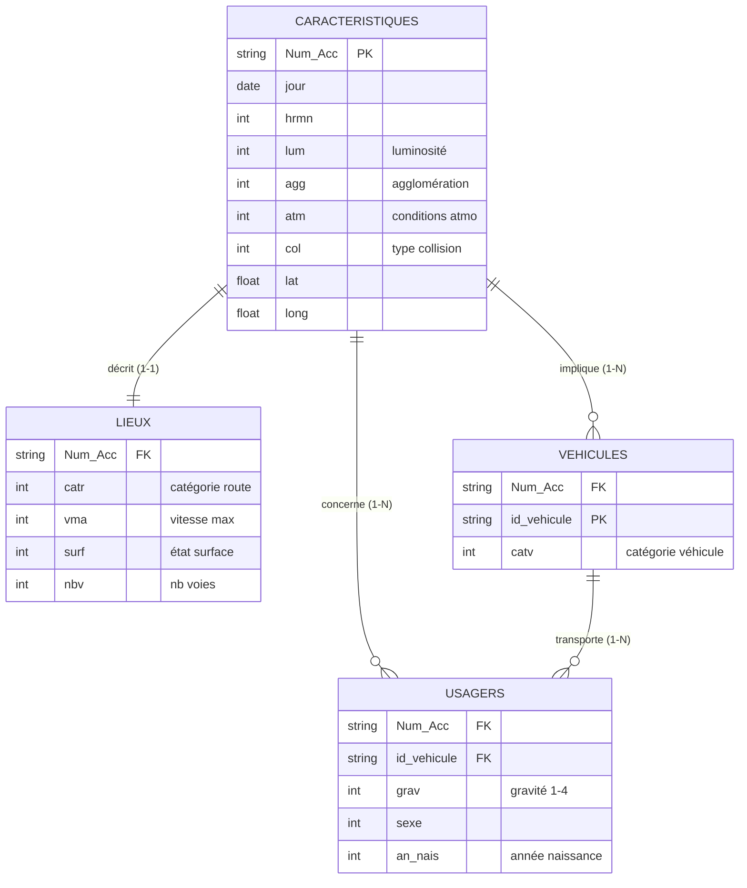
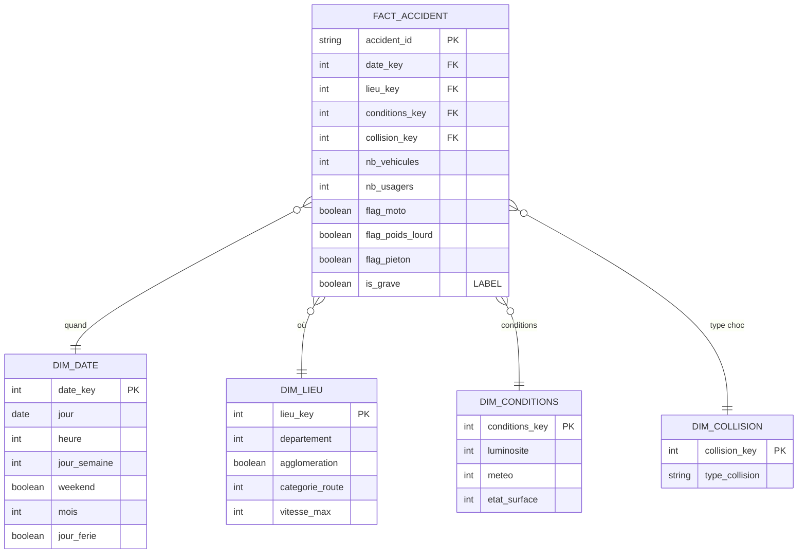
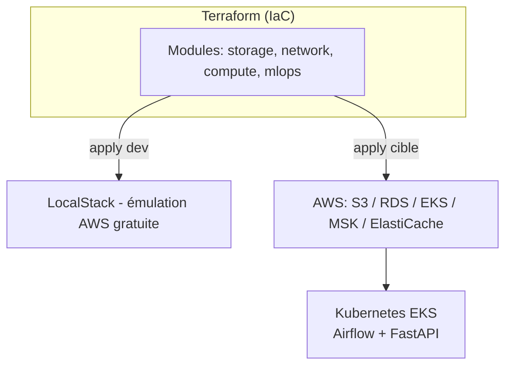

# Architecture de données — GRAVIA

> **Projet** : GRAVIA — Aide à la décision pour la priorisation des secours routiers
> **Version** : 0.1
> **Date** : 2026-06-29
> **Bloc RNCP** : Bloc 2 — Concevoir des architectures de données (pour l'IA)
> **Document amont** : [Cahier des charges](CDC_GRAVIA.md)

---

## 1. Besoins et contraintes architecturaux (C2.1)

| Dimension | Besoin / contrainte |
|---|---|
| **Volume** | BAAC ~2005→2024, quelques millions de lignes `usagers` (< 10 Go) — **tient en mémoire** |
| **Variété** | Structuré (BAAC) + semi-structuré (météo, géo) + flux temps réel (trafic) |
| **Vélocité** | Batch (millésimes annuels) + ingestion temps réel des signalements (cas d'usage secours) |
| **Latence de prédiction** | API temps réel p95 < 300 ms |
| **Sécurité / conformité** | Données personnelles + **santé** (gravité) → chiffrement, accès restreint, RGPD, AIPD |
| **Coût** | Projet jury → priorité au **gratuit / open source** ; pas d'accès au free tier AWS |
| **Évolutivité** | Architecture capable de monter en charge (cible cloud + Kubernetes) |

**Principe directeur** : dimensionner juste. Le volume modeste **interdit la sur-ingénierie** (pas de Spark/cluster en dev) mais l'architecture **cible** prévoit la montée en charge.

---

## 2. Vue d'ensemble

### 2.1 Deux environnements

| Couche | **Dev** (local, gratuit) | **Prod** (cible cloud, IaC) |
|---|---|---|
| Stockage objet (Bronze/Silver) | MinIO (S3-compatible) | AWS S3 |
| Base analytique (Gold) | PostgreSQL (Docker) | AWS RDS PostgreSQL |
| Traitement | **Polars / DuckDB** | Polars / DuckDB (conteneurisé) |
| Orchestration | **Airflow** (Docker Compose) | Airflow sur **Kubernetes (EKS)** |
| Conteneurs | Docker Compose | **Kubernetes (EKS)** |
| Serving | FastAPI (uvicorn) | FastAPI sur ECS/EKS |
| Tracking ML | MLflow (Docker) | MLflow |
| Qualité données | Great Expectations | Great Expectations |
| Temps réel | Redpanda/Kafka (local) | Kafka managé (MSK) |
| Monitoring infra | Prometheus + Grafana | Prometheus + Grafana |
| Monitoring modèle | Evidently | Evidently |
| Cache | Redis (Docker) | ElastiCache |
| IaC | **Terraform via LocalStack** | **Terraform → AWS** |
| CI/CD | GitHub Actions | GitHub Actions |

> **Stratégie de déploiement** : la prod est déployée **réellement** via Terraform contre **LocalStack** (émulation AWS locale, gratuite) → fournit l'IaC + la vidéo « infra en production » du référentiel sans coût. L'architecture **cible AWS** est documentée pour la défense orale.

### 2.2 Schéma logique

### 2.3 Origine des flux et du temps réel

| Flux | Origine | Réel / simulé |
|---|---|---|
| Historique accidents | Fichiers **BAAC** (data.gouv.fr), batch annuel | Réel |
| **Signalements** (à scorer) | **Simulateur de rejeu** : un producteur relit le BAAC et le réinjecte dans Redpanda/Kafka, horodaté comme un flux live | **Simulé** |
| **Trafic temps réel** (firehose) | État de circulation RRN + métropoles (débit/occupation, DATEX II), **milliers de mesures toutes les 1–6 min** | **Réel** |
| Météo | API **Open-Meteo** | Réel (temps réel) |
| Bulletins / incidents | Bulletins Bison Futé / alertes (**texte**, NLP léger) | Réel |

Le **flux haute fréquence** du système est la **donnée de trafic capteur** (réelle, milliers de mesures/min) : c'est elle qui justifie un bus de messages. Les **signalements** à scorer sont, eux, des événements peu fréquents **simulés par rejeu du BAAC** (la source opérationnelle réelle — régulation des secours — n'étant pas en open data). L'architecture temps réel est réelle et fonctionnelle ; en production, le rejeu serait remplacé par le feed réel de l'opérateur.

---

## 3. Choix technologiques et justifications

C'est le cœur de la défense (le jury note la **justification** des choix).

**Principe directeur — dimensionner selon le besoin réel.** (1) Le **moteur de traitement** est dimensionné *au plus juste* (Polars/DuckDB plutôt que Spark) ; (2) le **bus temps réel (Kafka/Redpanda)** est justifié par un **vrai flux haute fréquence** — les données de trafic capteur (milliers de mesures/min) ; (3) **Kubernetes** dépasse la charge actuelle et est retenu comme **cible de production** et pour couvrir la compétence cluster (C2.6) — choix de démonstration assumé.

| Brique | Choix | Justification | Alternative écartée |
|---|---|---|---|
| **Moteur de traitement** | **Polars / DuckDB** | Volume tient en RAM → plus rapide que Spark, zéro overhead cluster, code Python simple | **PySpark** : sur-dimensionné pour < 10 Go (over-engineering) |
| **Stockage Bronze/Silver** | Parquet sur MinIO/S3 | Colonnaire, compressé, standard lakehouse, narratif Medallion | Tout-relationnel : perd le narratif Bronze/Silver |
| **Stockage Gold** | **PostgreSQL — schéma en étoile** | Modélisation dimensionnelle attendue (C2.3), requêtage features, intégrité | Parquet seul : modélisation BDD moins explicite |
| **Orchestration** | Airflow (Docker) | Standard, DAGs, retries, monitoring, riche pour la démo | Prefect/Dagster : moins répandu en entreprise |
| **Conteneurisation / scaling** | Docker (dev) → **Kubernetes/EKS** (cible) | Couche de scaling/résilience ; couvre la compétence **cluster (C2.6)** ; **choix de démonstration assumé**, pas dicté par la charge | k8s en dev (sur-ingénierie) ; ECS Fargate (plus simple mais ne démontre pas les clusters) |
| **Serving** | FastAPI | Performant, async, OpenAPI natif, typé (Pydantic) | Flask : moins adapté au temps réel |
| **Cache** | Redis (dev) / ElastiCache (prod) | Cache des **enrichissements temps réel** (trafic/météo par zone, rafraîchis périodiquement) : évite un appel externe à chaque prédiction et aide à tenir la **latence p95 < 300 ms** | Aucun cache : appels externes répétés, latence dégradée |
| **Modèle IA** | **Benchmark** : régression logistique (baseline), Random Forest, LightGBM/XGBoost — modèle retenu selon les métriques | Comparaison reproductible (MLflow) ; gradient boosting anticipé favori sur tabulaire déséquilibré, explicable (SHAP) | Deep learning : inutile sur tabulaire de ce volume |
| **Tracking / registry** | MLflow | Standard, reproductibilité, registry Staging/Prod | — |
| **Qualité données** | Great Expectations | Tests déclaratifs, rapports, intégrable au pipeline | — |
| **Temps réel** | Redpanda (dev) / Kafka MSK (prod) | Absorbe un **flux trafic haute fréquence réel** (milliers de mesures/min, DATEX II) + les signalements à scorer ; compatible Kafka (bascule dev→prod sans code) ; couvre C3.1 | File simple : insuffisante pour ce débit ; Kafka complet en dev : lourd (d'où Redpanda) |
| **Monitoring** | Prometheus+Grafana (infra) / Evidently (modèle) | Standards, dérive intégrée | — |
| **IaC** | Terraform (LocalStack → AWS) | IaC réelle gratuite via LocalStack, cible AWS documentée | — |

### Note — démonstration Spark (optionnelle)
Polars/DuckDB est le moteur retenu. La **compétence Spark** peut être prouvée via **un notebook Databricks Community** rejouant une transformation « à l'échelle prod », documenté comme **voie de montée en charge** — sans faire de Spark le moteur du pipeline.

### Note — dimensionnement (anticiper l'objection « sur-ingénierie »)
Trois cas distincts : le rejet de **Spark** relève du *dimensionnement du traitement* (volume en mémoire) ; **Kafka** est justifié par un **flux haute fréquence réel** (trafic capteur, milliers de mesures/min) — ce n'est pas de la sur-ingénierie ; seul **Kubernetes** dépasse la charge actuelle et est retenu comme **cible de production** et **preuve de compétence cluster (C2.6)**.

---

## 4. Modélisation des données (C2.3 / C2.4)

### 4.1 Modèle conceptuel (source BAAC)

Les 4 tables BAAC sont reliées par l'identifiant d'accident (`Num_Acc`).

### 4.2 Modèle physique Gold — schéma en étoile

Grain de la table de faits : **un accident**. La gravité par usager est agrégée en label binaire (`is_grave` = au moins un usager hospitalisé ou tué).

> **Anti-leakage** : seules les variables connues **au moment du signalement** alimentent `FACT_ACCIDENT` et les dimensions. Les champs renseignés après enquête (équipement de sécurité, nature précise des blessures, manœuvre) sont **exclus** des features (cf. CDC §3).

---

## 5. Architecture Medallion

| Couche | Contenu | Format / stockage | Transformations |
|---|---|---|---|
| **Bronze** | Données brutes telles qu'ingérées | Parquet (MinIO/S3) | Aucune (traçabilité de la source) |
| **Silver** | Nettoyé, typé, **pseudonymisé**, enrichi (météo/géo) | Parquet (MinIO/S3) | Dédoublonnage, gestion des manquants, jointures, encodage, agrégation géographique |
| **Gold** | Features model-ready, schéma en étoile, label | PostgreSQL | Construction faits/dimensions, label `is_grave`, features |

---

## 6. Déploiement et IaC (C2.5 / C2.6)

### 6.1 Dev
- **Docker Compose** : MinIO, PostgreSQL, Airflow, MLflow, Redis, Redpanda, FastAPI, Prometheus, Grafana.

### 6.2 Prod (cible) déployée via Terraform
- **LocalStack** : `terraform apply` réel et gratuit émulant AWS (S3, IAM, etc.) → IaC + vidéo de prod.
- **Architecture cible AWS** documentée : S3, RDS PostgreSQL, **EKS (Kubernetes)** pour Airflow + serving, MSK (Kafka), ElastiCache, ECR.
- **Kubernetes / EKS** : couche de scaling et d'orchestration de conteneurs (C2.6). Démonstration locale possible via **k3s/kind**.

### 6.3 Organisation en deux dépôts

Le code est réparti sur l'organisation GitHub **VigiRoute**, conformément à l'exigence de certification (deux dépôts distincts) :

| Dépôt | Rôle | Contenu |
|---|---|---|
| **[gravia](https://github.com/VigiRoute/gravia)** | Solution IA | Code, pipelines de données, stack dev (docker-compose), docs |
| **[gravia-mlops](https://github.com/VigiRoute/gravia-mlops)** | CI/CD + déploiement | Terraform (IaC), manifests Kubernetes, workflows de déploiement |

Le Terraform et les workflows de déploiement décrits ci-dessus résident dans **gravia-mlops** ; `gravia` héberge la solution et le `docker-compose` de développement.

---

## 7. Sécurité et conformité (lien Bloc 1)

| Aspect | Mesure |
|---|---|
| Chiffrement | Au repos (S3/RDS) et en transit (TLS) |
| Pseudonymisation | Dès la couche Silver (cf. risque de ré-identification) |
| Gestion des accès | Moindre privilège (IAM / rôles PostgreSQL) |
| Secrets | Variables d'environnement `.env` (dev) / Secrets Manager (cible) |
| Traçabilité | Lineage des transformations, journalisation des prédictions |
| Données de santé | AIPD obligatoire, minimisation, durées de conservation |

---

## 8. Scalabilité, performance et tolérance aux pannes

| Critère | Réponse |
|---|---|
| Montée en charge données | Polars/DuckDB en mémoire ; partitionnement Parquet par millésime |
| Montée en charge service | Conteneurs FastAPI répliqués sur Kubernetes (HPA) |
| Performance requêtes | Index PostgreSQL sur clés du schéma étoile |
| Tolérance aux pannes | Redondance S3/RDS (cible), retries Airflow, redémarrage automatique des pods |
| Reproductibilité | Versioning code (Git) + données (millésimes) + modèles (MLflow) |

---

## 9. Surveillance de l'infrastructure (C2.7)

- **Prometheus** : métriques système et applicatives (CPU, mémoire, latence API).
- **Grafana** : tableaux de bord + alertes (latence p95, taux d'erreur, disponibilité).
- **Great Expectations** : qualité des données à chaque exécution de pipeline.
- **Evidently** : dérive des données et du modèle (déclencheur de réentraînement).

---

## 10. Accessibilité de la documentation (C2.8)

- Diagrammes accompagnés de descriptions textuelles (lecture sans visuel possible).
- Structure de titres hiérarchisée, langage vulgarisé.
- Documents fournis en formats ouverts et accessibles (Markdown, PDF balisé).

---

## 11. Décisions d'architecture (synthèse à défendre)

1. **Polars/DuckDB plutôt que Spark** : volume en mémoire → éviter la sur-ingénierie ; Spark gardé comme voie de montée en charge.
2. **Hybride lac + PostgreSQL** : Medallion pour le narratif + schéma en étoile relationnel pour la modélisation attendue.
3. **LocalStack pour Terraform** : IaC et déploiement « production » réels et gratuits, sans accès AWS payant.
4. **Kubernetes en cible, pas en dev** : couvre la compétence cluster (C2.6) sans alourdir le développement.
5. **Anti-leakage strict** : features limitées aux informations connues au signalement.

---

## 12. Références

- [Cahier des charges GRAVIA](CDC_GRAVIA.md)
- Référentiel RNCP — Bloc 2
- LocalStack — https://www.localstack.cloud/
- Polars — https://pola.rs/ · DuckDB — https://duckdb.org/
