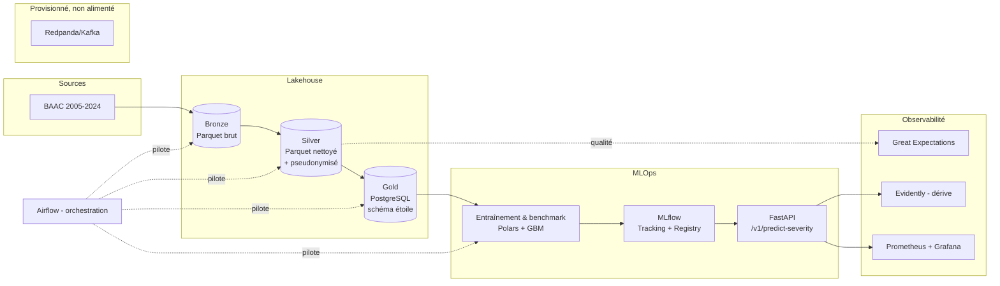
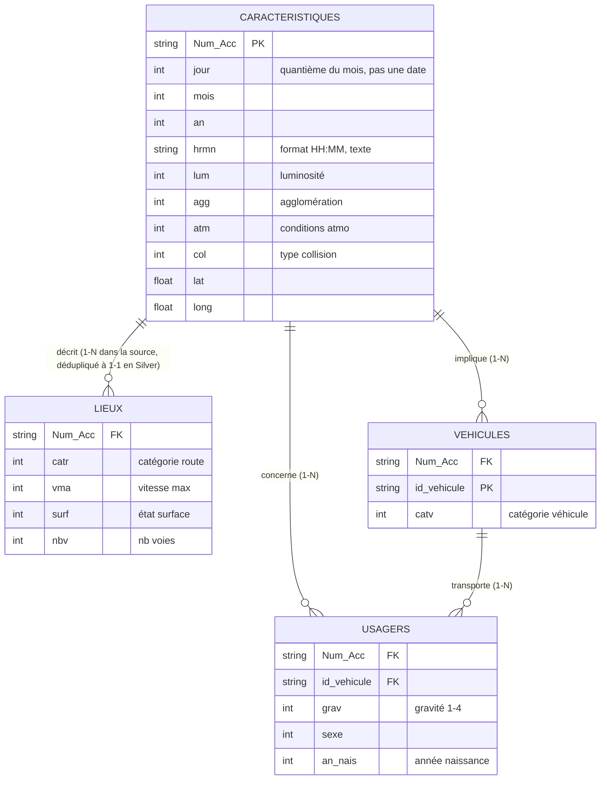
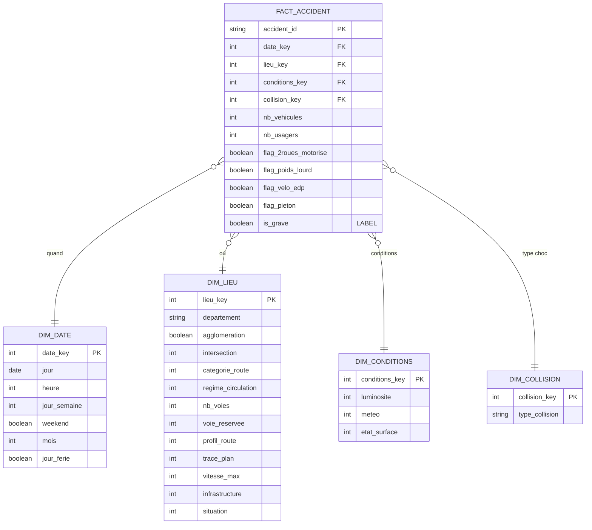
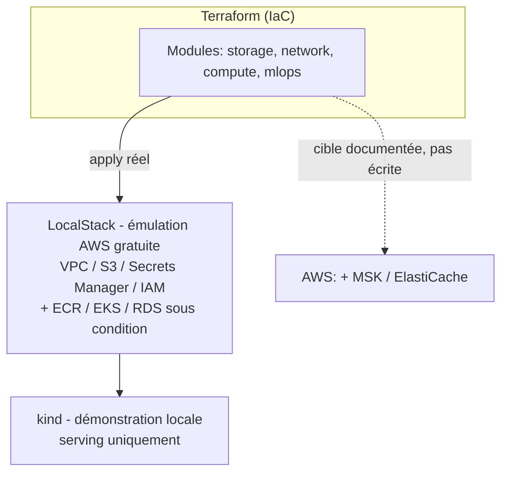

# Architecture de données — GRAVIA

> **Projet** : GRAVIA — Aide à la décision pour la priorisation des secours routiers
> **Version** : 0.2 (révisé après implémentation — cadrage initial du 2026-06-29, périmètre réel confirmé/corrigé au 2026-09-13, cf. [AVANCEMENT_GRAVIA.md](AVANCEMENT_GRAVIA.md))
> **Date de dernière révision** : 2026-09-13
> **Bloc RNCP** : Bloc 2 — Concevoir des architectures de données (pour l'IA)
> **Document amont** : [Cahier des charges](CDC_GRAVIA.md)

---

## 1. Besoins et contraintes architecturaux

| Dimension | Besoin / contrainte |
|---|---|
| **Volume** | BAAC ~2005→2024, quelques millions de lignes `usagers` (< 10 Go) — **tient en mémoire** |
| **Variété** | Structuré (BAAC, CSV) réellement exploité ; semi-structuré (trafic XML DATEX) **exploré en batch**, testé comme feature d'entraînement et écarté (gain prédictif nul) — météo/géo externes envisagées au cadrage, jamais engagées (BAAC porte déjà `atm`/`catr`/`vma`/`nbv`) |
| **Vélocité** | Batch (millésimes annuels) uniquement. Une ingestion temps réel des signalements était visée au cadrage (bus de messages provisionné) mais le pipeline applicatif n'a pas été implémenté — scope assumé, cf. §2.3 |
| **Latence de prédiction** | API temps réel p95 < 300 ms |
| **Sécurité / conformité** | Données personnelles + **santé** (gravité) → chiffrement, accès restreint, RGPD, AIPD |
| **Coût** | Priorité au **gratuit / open source** ; pas d'accès à un cloud payant |
| **Évolutivité** | Architecture capable de monter en charge (cible cloud + Kubernetes) |

**Principe directeur** : dimensionner juste. Le volume modeste **interdit la sur-ingénierie** (pas de Spark/cluster en dev) mais l'architecture **cible** prévoit la montée en charge.

---

## 2. Vue d'ensemble

### 2.1 Deux environnements

| Couche | **Dev** (local, gratuit) | **Prod** (cible cloud, IaC) |
|---|---|---|
| Stockage objet (Bronze/Silver) | MinIO (S3-compatible) | AWS S3 |
| Base analytique (Gold) | PostgreSQL (Docker) | AWS RDS PostgreSQL |
| Traitement | **Polars** | Polars (conteneurisé) |
| Orchestration | **Airflow** (Docker Compose) | Airflow sur **Kubernetes (EKS)** |
| Conteneurs | Docker Compose | **Kubernetes (EKS)** |
| Serving | FastAPI (uvicorn) | FastAPI sur ECS/EKS |
| Tracking ML | MLflow (Docker) | MLflow |
| Qualité données | Great Expectations | Great Expectations |
| Temps réel | Redpanda/Kafka (local) | Kafka managé (MSK) |
| Monitoring infra | Prometheus + Grafana | Prometheus + Grafana |
| Monitoring modèle | Evidently | Evidently |
| Cache | Redis (Docker) | ElastiCache |
| IaC | **Terraform via LocalStack** | **Terraform → AWS** |
| CI/CD | GitHub Actions | GitHub Actions |

> **Stratégie de déploiement — portée exacte de la démonstration LocalStack.** Le **même code Terraform** (mêmes modules, mêmes ressources) cible LocalStack ou AWS réel : seuls l'endpoint et les identifiants changent, aucune ligne d'IaC n'est spécifique à l'émulateur. Le `terraform apply` contre **LocalStack** (émulation locale et gratuite de l'API AWS) est un déploiement **réel** du code d'infrastructure — ressources effectivement créées, dépendances résolues, aucun plan simulé. **Ce que ça démontre** : l'IaC de production est complet et exécutable de bout en bout. **Ce que ça ne démontre pas** : une charge de production réelle (trafic utilisateur, coûts, latence réseau inter-AZ, SLA) — hors de portée sans budget cloud payant. Le référentiel autorisant une démonstration « dans le cloud ou on-premise », LocalStack (exécution locale, API cloud fidèle) se situe explicitement à cette frontière. L'architecture **cible AWS** est intégralement documentée pour la bascule réelle et pour la défense orale.

### 2.2 Schéma logique

Météo, géo et trafic temps réel (DATEX) ne figurent plus comme sources actives du diagramme : aucune des trois n'alimente le pipeline (cf. §2.3). Le bus Redpanda/Kafka est provisionné dans la stack dev (démonstration de la capacité) mais n'a aucun producteur ni consommateur applicatif branché dessus.

### 2.3 Origine des flux et du temps réel

| Flux | Origine envisagée | Statut réel |
|---|---|---|
| Historique accidents | Fichiers **BAAC** (data.gouv.fr), batch annuel | **Réel** — seule source effectivement ingérée |
| **Signalements** (à scorer) | Simulateur de rejeu : un producteur relit le BAAC et le réinjecte dans Redpanda/Kafka, horodaté comme un flux live | **Non implémenté** — aucun producteur de rejeu construit. Le scoring réel se fait de façon synchrone via l'API REST (`POST /v1/predict-severity`) |
| **Trafic** (firehose visé) | État de circulation RRN + métropoles (débit/occupation, DATEX II), milliers de mesures toutes les 1–6 min | **Exploré en batch uniquement** (snapshots XML téléchargés) : testé comme feature du modèle et écarté (gain prédictif nul, CDC §13.6). Jamais ingéré en flux, aucun bus alimenté |
| Météo | API Open-Meteo | **Jamais implémentée** — le BAAC porte déjà une variable météo (`atm`) |

**Choix de périmètre assumé** (même logique que l'arbitrage déjà documenté pour le trafic et les bulletins, CDC §13.6) : le bus de messages (Redpanda, compatible Kafka) est **provisionné** dans la stack dev pour démontrer la capacité d'architecture temps réel attendue par le référentiel, mais **aucun producteur ni consommateur applicatif n'a été implémenté**. Le raisonnement qui justifierait Kafka reste valable en théorie — un flux de signalements seul (~150/jour) est insuffisant, il faudrait un flux à fort volume comme le trafic pour le justifier opérationnellement (aide au routage des secours, indépendamment de son usage en feature) — mais ce flux n'a pas été implémenté dans le périmètre de ce projet, seulement exploré en batch pour évaluer son apport au modèle. **Reste à construire en production** : un producteur (rejeu ou feed réel de l'opérateur) et un consommateur appelant l'API de scoring.

> **Bulletins d'incidents (texte)** — retirés du périmètre (source réelle non identifiée, cf. CDC §13.6). Aucun flux non structuré n'alimente donc le pipeline à ce stade ; la variété du dataset repose sur structuré + semi-structuré uniquement.

---

## 3. Choix technologiques et justifications

Chaque brique est justifiée au regard des contraintes du projet.

**Principe directeur — dimensionner selon le besoin réel.** (1) Le **moteur de traitement** est dimensionné *au plus juste* (Polars plutôt que Spark) ; (2) le **bus temps réel (Kafka/Redpanda)** se justifierait par un flux haute fréquence — les données de trafic capteur (milliers de mesures/min), utiles opérationnellement (routage des secours) indépendamment de leur usage comme feature du modèle IA — mais ce flux n'a été qu'**exploré en batch**, jamais implémenté en ingestion temps réel (cf. §2.3) : le bus reste provisionné pour démontrer la capacité, non alimenté par une application réelle ; (3) **Kubernetes** assure le **scaling horizontal et la haute disponibilité** du service en production.

| Brique | Choix | Justification | Alternative écartée |
|---|---|---|---|
| **Moteur de traitement** | **Polars** | Volume tient en RAM → plus rapide que Spark, zéro overhead cluster, code Python simple. `duckdb` a été retiré des dépendances (`pyproject.toml`) : envisagé au cadrage, jamais utilisé — tout le traitement passe par Polars (Bronze/Silver/Gold) et SQL PostgreSQL (Gold, `ml/features`) | **PySpark** : sur-dimensionné pour < 10 Go (over-engineering) |
| **Stockage Bronze/Silver** | Parquet sur MinIO/S3 | Colonnaire, compressé, standard lakehouse, narratif Medallion | Tout-relationnel : perd le narratif Bronze/Silver |
| **Stockage Gold** | **PostgreSQL — schéma en étoile** | Modélisation dimensionnelle, requêtage features, intégrité | Parquet seul : modélisation BDD moins explicite |
| **Orchestration** | Airflow (Docker) | Standard, DAGs, retries, monitoring, riche pour la démo | Prefect/Dagster : moins répandu en entreprise |
| **Conteneurisation / scaling** | Docker (dev) → **Kubernetes/EKS** (cible) | Scaling horizontal et **haute disponibilité** du service en production ; orchestration des conteneurs | k8s en dev (sur-ingénierie) ; ECS Fargate (plus simple, moins de contrôle sur l'orchestration) |
| **Serving** | FastAPI | Performant, async, OpenAPI natif, typé (Pydantic) | Flask : moins adapté au temps réel |
| **Cache** | Redis (dev) / ElastiCache (prod) | **Provisionné, non utilisé à ce jour** : envisagé au cadrage pour un enrichissement météo temps réel jamais implémenté (§2.3) — aucun module du serving ne s'y connecte. Le serving actuel n'a besoin d'aucun cache pour tenir la latence p95 &lt; 300 ms (cf. `docs/serving_performance.md`) | Aucun cache : pertinent seulement si un enrichissement externe était réintroduit |
| **Modèle IA** | **Benchmark** : régression logistique (baseline), Random Forest, LightGBM/XGBoost — modèle retenu selon les métriques | Comparaison reproductible (MLflow) ; gradient boosting anticipé favori sur tabulaire déséquilibré, explicable (SHAP) | Deep learning : inutile sur tabulaire de ce volume |
| **Tracking / registry** | MLflow | Standard, reproductibilité, registry avec alias `staging` (les stages Staging/Production sont dépréciés depuis MLflow 2.9, remplacés par des alias — `models:/gravia-severity-classifier@staging`, cf. `ml/serving/model.py`) | — |
| **Qualité données** | Great Expectations | Tests déclaratifs, rapports, intégrable au pipeline | — |
| **Temps réel** | Redpanda (dev) / Kafka MSK (prod) | **Provisionné, non alimenté** : dimensionné pour absorber un flux trafic haute fréquence (milliers de mesures/min, DATEX II) et les signalements à scorer, mais aucun producteur/consommateur applicatif n'a été implémenté (§2.3) ; compatible Kafka (bascule dev→prod sans code) si le pipeline applicatif est construit | File simple : insuffisante pour ce débit visé ; Kafka complet en dev : lourd (d'où Redpanda) |
| **Monitoring** | Prometheus+Grafana (infra) / Evidently (modèle) | Standards, dérive intégrée | — |
| **IaC** | Terraform (LocalStack → AWS) | Même code IaC pour LocalStack et AWS (bascule par endpoint/identifiants) : déploiement réel et gratuit qui prouve l'exécutabilité de l'infrastructure, sans simuler une charge de production réelle ; cible AWS documentée | — |

### Note — démonstration Spark (optionnelle)
Polars est le moteur retenu. La **compétence Spark** peut être prouvée via **un notebook Databricks Community** rejouant une transformation « à l'échelle prod », documenté comme **voie de montée en charge** — sans faire de Spark le moteur du pipeline.

### Note — dimensionnement (anticiper l'objection « sur-ingénierie »)
Trois cas distincts : le rejet de **Spark** relève du *dimensionnement du traitement* (volume en mémoire) ; **Kafka** se justifierait par un flux haute fréquence (trafic capteur, milliers de mesures/min) mais reste provisionné sans pipeline applicatif réel (§2.3) ; seul **Kubernetes** dépasse la charge actuelle, retenu pour le **scaling et la haute disponibilité** du service en production.

---

## 4. Modélisation des données

### 4.1 Modèle conceptuel (source BAAC)

Les 4 tables BAAC sont reliées par l'identifiant d'accident (`Num_Acc`).

### 4.2 Modèle physique Gold — schéma en étoile

Grain de la table de faits : **un accident**. La gravité par usager est agrégée en label binaire (`is_grave` = au moins un usager hospitalisé ou tué).

> **Schéma vérifié contre le baseline déjà validé** (`notebooks/eda_baseline_baac.py`, recall 0,808 / F1 macro 0,708) : `DIM_LIEU` reprend tous les attributs `lieux`/`caracteristiques` qu'il utilise (pas seulement les 4 attributs de l'esquisse de départ), sans quoi le schéma en étoile serait structurellement incapable de reproduire ce résultat. `departement` est en `string`, pas `int` : les codes INSEE de Corse (`2A`, `2B`) ne sont pas numériques. Les flags véhicule/usager de `FACT_ACCIDENT` reprennent la configuration réellement validée dans `notebooks/eval_enrichissement_vs_seuil.py`, pas l'esquisse `flag_moto` jamais testée.

> **Anti-leakage** : seules les variables connues **au moment du signalement** alimentent `FACT_ACCIDENT` et les dimensions. Les champs renseignés après enquête (équipement de sécurité, nature précise des blessures, manœuvre) sont **exclus** des features (cf. CDC §3).

> **Décidé après exploration (EDA + baseline, cf. CDC §13.6-7).** Le schéma ci-dessus reflète la décision finale, pas la version de départ : ni le **trafic** ni les **bulletins d'incidents** n'apparaissent comme features. Le trafic a été testé (jointure, corrélation statistique, gain mesuré en modèle dédié Paris puis en configuration nationale sparse) et **écarté** : signal réel mais gain prédictif nul une fois le modèle doté des variables temporelles (heure/jour/mois). Les bulletins sont **retirés** : aucune source réelle identifiée. Le baseline BAAC seul atteint déjà les seuils CDC agrégés (recall grave 0,808, F1 macro 0,708), avec une réserve importante documentée en CDC §14 : un seuil de décision unique masque un recall quasi nul sur les zones à faible taux de gravité de base (ex. Paris), à traiter avant mise en production.

---

## 5. Architecture Medallion

| Couche | Contenu | Format / stockage | Transformations |
|---|---|---|---|
| **Bronze** | Données brutes telles qu'ingérées | Parquet (MinIO/S3) | Aucune (traçabilité de la source) |
| **Silver** | Nettoyé, typé, **pseudonymisé**, une table par entité BAAC (caractéristiques/lieux/véhicules/usagers) | Parquet (MinIO/S3) | Dédoublonnage, typage strict, gestion des manquants, agrégation géographique (pseudonymisation) — **pas de jointure inter-table** |
| **Gold** | Features model-ready, schéma en étoile, label | PostgreSQL | Jointure des 4 tables Silver (`Num_Acc`, `id_vehicule`), construction faits/dimensions, label `is_grave`, features |

---

## 6. Déploiement et IaC

### 6.1 Dev
- **Docker Compose** : MinIO, PostgreSQL, Airflow, MLflow, Redis, Redpanda, FastAPI, Prometheus, Grafana.

### 6.2 Prod (cible) — ce que le Terraform couvre réellement
- **LocalStack** : `terraform apply` réel et gratuit du même code IaC qu'AWS (S3, IAM, etc.), émulant fidèlement l'API AWS → prouve l'exécutabilité de l'infrastructure, pas une charge de production réelle (cf. §2.1 pour la portée exacte).
- **Architecture cible AWS documentée** (schéma cible, pour l'oral) : S3, RDS PostgreSQL, EKS (Kubernetes), MSK (Kafka), ElastiCache, ECR.
- **Ce que le Terraform (`gravia-mlops/terraform/`) écrit réellement** : VPC/subnets/security groups, S3, Secrets Manager, IAM — plus, sous condition (`var.include_pro_only_services`, jamais activée contre LocalStack Community qui ne les supporte pas) : ECR, EKS, RDS. **MSK et ElastiCache ne sont écrits nulle part**, même conditionnellement — cohérent avec le bus de messages et le cache tous deux **provisionnés en dev mais non alimentés** (§2.3, §3) : il n'y avait pas de sens à écrire l'IaC de deux services dont l'usage applicatif reste à construire.
- **Kubernetes / EKS** : couche de scaling et d'orchestration de conteneurs pour la haute disponibilité. Démonstration locale via **kind**, mais **seulement pour le serving** (`gravia-mlops/k8s/serving-*.yaml`) — Airflow n'a pas été redéployé sur ce cluster, il ne tourne qu'en Docker Compose (dev).

### 6.3 Organisation en deux dépôts

Le code est réparti sur l'organisation GitHub **VigiRoute**, conformément à l'exigence de certification (deux dépôts distincts) :

| Dépôt | Rôle | Contenu |
|---|---|---|
| **[gravia](https://github.com/VigiRoute/gravia)** | Solution IA | Code, pipelines de données, stack dev (docker-compose), docs |
| **[gravia-mlops](https://github.com/VigiRoute/gravia-mlops)** | CI/CD + déploiement | Terraform (IaC), manifests Kubernetes, workflows de déploiement |

Le Terraform et les workflows de déploiement décrits ci-dessus résident dans **gravia-mlops** ; `gravia` héberge la solution et le `docker-compose` de développement.

---

## 7. Sécurité et conformité (lien Bloc 1)

Mesures **cibles** — statut réel de mise en œuvre détaillé dans Gouvernance §7 et AIPD §5 :

| Aspect | Mesure | Statut |
|---|---|---|
| Chiffrement | Au repos (S3/RDS) et en transit (TLS) | À implémenter — pas de cloud réel déployé |
| Pseudonymisation | Dès la couche Silver (cf. risque de ré-identification) | **Fait** — `lat`/`long`/`adr`/`voie`/`pr`/`pr1` supprimées |
| Gestion des accès | Moindre privilège (IAM / rôles PostgreSQL) | À implémenter |
| Secrets | Variables d'environnement `.env` (dev) / Secrets Manager (cible) | **Fait** en dev (`.env` gitignoré) |
| Traçabilité | Lineage des transformations, journalisation des prédictions | **Partiel** — prédictions journalisées en logs, pas de registre interrogeable 12 mois |
| Données de santé | AIPD obligatoire, minimisation, durées de conservation | **Fait** (AIPD rédigée, minimisation en Silver) |

---

## 8. Scalabilité, performance et tolérance aux pannes

| Critère | Réponse |
|---|---|
| Montée en charge données | Polars en mémoire ; partitionnement Parquet par millésime |
| Montée en charge service | Conteneurs FastAPI répliqués sur Kubernetes — réplication fixe vérifiée (`replicas: 2`, `gravia-mlops/k8s/serving-deployment.yaml`) ; `HorizontalPodAutoscaler` non implémenté à ce jour |
| Performance requêtes | Index PostgreSQL sur clés du schéma étoile |
| Tolérance aux pannes | Redondance S3/RDS (cible), retries Airflow, redémarrage automatique des pods |
| Reproductibilité | Versioning code (Git) + données (millésimes) + modèles (MLflow) |

---

## 9. Surveillance de l'infrastructure

- **Prometheus** : instrumentation de l'API (`prometheus-fastapi-instrumentator`, endpoint `/metrics`) — latence, débit, taux d'erreur.
- **Grafana** : tableau de bord provisionné (6 panels : p50/p95 vs seuil CDC ENF-1 300 ms, débit par endpoint, taux d'erreur, total requêtes, disponibilité de la cible), vérifié sur trafic réel (p95 ≈ 95 ms mesuré). **Pas d'alerte configurée à ce jour** — les seuils sont visibles sur le dashboard, pas encore câblés à une notification automatique.
- **Great Expectations** : qualité des données à chaque exécution de pipeline.
- **Evidently** : dérive des données et du modèle (déclencheur de réentraînement).

---

## 10. Accessibilité de la documentation

- Diagrammes accompagnés de descriptions textuelles (lecture sans visuel possible).
- Structure de titres hiérarchisée, langage vulgarisé.
- Documents fournis en formats ouverts et accessibles (Markdown, PDF balisé).

---

## 11. Synthèse des décisions d'architecture

1. **Polars plutôt que Spark** : volume en mémoire → éviter la sur-ingénierie ; Spark gardé comme voie de montée en charge.
2. **Hybride lac + PostgreSQL** : Medallion pour le narratif + schéma en étoile relationnel pour la modélisation attendue.
3. **LocalStack pour Terraform** : même code IaC que la cible AWS (bascule par endpoint/identifiants uniquement), déploiement réel et gratuit qui prouve l'exécutabilité de l'infrastructure — sans simuler une charge de production réelle, hors de portée sans budget cloud payant.
4. **Kubernetes en cible, pas en dev** : scaling et haute disponibilité en production, sans alourdir le développement.
5. **Anti-leakage strict** : features limitées aux informations connues au signalement.
6. **Trafic testé comme feature du modèle de gravité et écarté** (gain prédictif nul, exploré en batch uniquement) : sa valeur opérationnelle propre (aide au routage des secours) justifierait en théorie une ingestion temps réel indépendante du modèle IA, mais ce pipeline temps réel n'a pas été implémenté dans le périmètre de ce projet — choix de périmètre assumé et documenté (§2.3).

---

## 12. Références

- [Cahier des charges GRAVIA](CDC_GRAVIA.md)
- Référentiel RNCP — Bloc 2
- LocalStack — https://www.localstack.cloud/
- Polars — https://pola.rs/

---

## Annexe — Correspondance avec le référentiel (Bloc 2)

| Compétence | Couverture dans ce document |
|---|---|
| C2.1 — Évaluation des besoins et contraintes | §1 |
| C2.2 — Cahier des charges d'architecture | Ce document (+ CDC) |
| C2.3 — Modèles logiques et physiques | §4 (MCD, schéma en étoile) |
| C2.4 — Structures de bases de données | §4, §5 |
| C2.5 — Serveurs cloud / on-premise | §2, §6 |
| C2.6 — Clusters de calcul et scaling | §6 (Kubernetes / EKS) |
| C2.7 — Surveillance de l'infrastructure | §9 |
| C2.8 — Documentation accessible | §10 |
