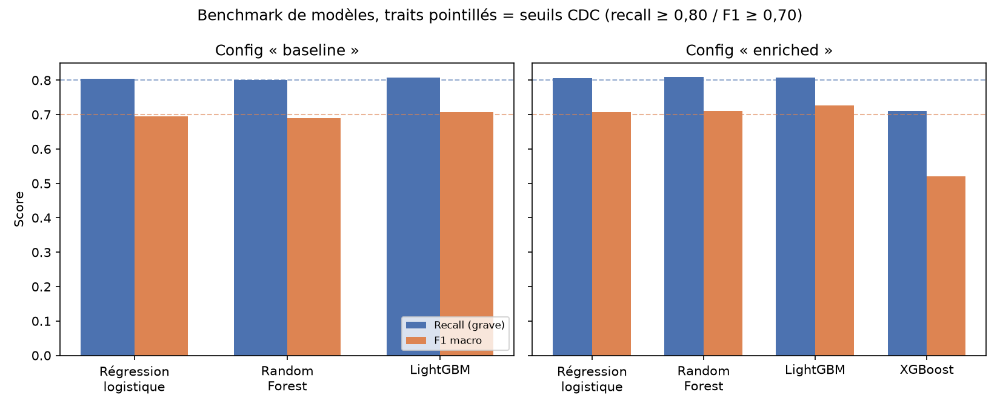

# Benchmark de modèles : GRAVIA

Résultats du benchmark prévu par [Architecture_GRAVIA.md §3](Architecture_GRAVIA.md) (« Benchmark :
régression logistique (baseline), Random Forest, LightGBM/XGBoost, modèle retenu selon les
métriques »), produit par [`ml/training/benchmark.py`](../ml/training/benchmark.py). XGBoost avait
d'abord été laissé de côté (le document citait « LightGBM/XGBoost » comme une alternative, pas
comme deux modèles à tester en plus l'un de l'autre, et LightGBM était déjà la dépendance figée du
projet, validée dans les notebooks) puis ajouté sur demande explicite pour une vraie comparaison
(cf. section « Configuration `"enriched"` » ci-dessous) : il ressort nettement moins bon que les
trois autres candidats sur ce jeu de données.

Protocole identique à la référence déjà publiée (cf. [CDC_GRAVIA.md §13.7](CDC_GRAVIA.md)) : train
2019-2021, seuil de décision calibré sur validation 2022 (cible recall ≥ 0,80), évalué sur le
holdout 2023, jamais vu, y compris pour le calibrage. Features : configuration `"baseline"`
(cf. `ml/features/gold_features.py`), 273 226 accidents.

## Résultats : configuration `"baseline"`

| Modèle | Recall grave | F1 macro | Seuil calibré | Seuils CDC (recall ≥ 0,80 / F1 ≥ 0,70) |
|---|---|---|---|---|
| Régression logistique | 0,804 | 0,695 | 0,44 | F1 macro sous le seuil |
| Random Forest | 0,801 | 0,690 | 0,38 | F1 macro sous le seuil |
| **LightGBM** | **0,807** | **0,707** | 0,44 | **Atteints** |

→ **LightGBM retenu**, seul modèle des trois à franchir les deux seuils CDC. Enregistré dans le
registry MLflow (`gravia-severity-classifier` v1 ; les stages Staging/Production sont dépréciés
depuis MLflow 2.9, remplacés par les alias). Les deux autres restent trackés dans MLflow
(comparaison reproductible) mais ne sont pas enregistrés : promotion bloquée sous les seuils CDC
(cf. [CDC_GRAVIA.md §11](CDC_GRAVIA.md)). **v1 n'est plus le modèle `@staging`** depuis la promotion
du LightGBM enriched (v2, cf. section suivante) ; reste dans le registry comme historique/point de
comparaison, rechargeable explicitement via `models:/gravia-severity-classifier/1`.

## Résultats : configuration `"enriched"`

Flags véhicule/usager (`flag_2roues_motorise`/`flag_poids_lourd`/`flag_velo_edp`/`flag_pieton`),
meilleure configuration déjà repérée dans `notebooks/eval_enrichissement_vs_seuil.ipynb` (config C :
recall 0,805 / F1 macro 0,727 avec un seuil unique). Même protocole, désormais 4 modèles (XGBoost
ajouté le 2026-09-20, cf. « XGBoost : ajouté et écarté » ci-dessous), chacun avec ses
hyperparamètres réglés par recherche aléatoire plutôt qu'à des valeurs fixes (cf. « Recherche
d'hyperparamètres » ci-dessous) :

| Modèle | Recall grave | F1 macro | Seuil calibré | Seuils CDC |
|---|---|---|---|---|
| Régression logistique | 0,806 | 0,707 | 0,45 | Atteints |
| Random Forest | 0,804 | 0,716 | 0,45 | Atteints |
| **LightGBM** | 0,808 | **0,726** | 0,47 | **Atteints** |
| XGBoost | 0,714 | 0,480 | 0,47 | Non atteints (recall < 0,80) |

→ **LightGBM reste le meilleur modèle**, seul candidat au-dessus de 0,72 de F1 macro. L'enrichissement
seul (sans calibration par département) apporte un vrai gain de F1 macro par rapport au baseline
(0,707/0,708 → 0,726) sans coût sur le recall, pour les trois modèles qui le franchissent.
**Meilleur modèle du benchmark toutes configurations confondues, promu à l'alias `staging`**
(`gravia-severity-classifier` v2, 2026-08-27, décision explicite de l'utilisateur ; réentraîné et
re-promu en v4 le 2026-09-20 lors de l'ajout de XGBoost au comparatif, en v5 le 2026-09-21 lors de
l'ajout de la recherche d'hyperparamètres, puis en v6 le 2026-09-24 lors du retrait de
`jour_semaine` — cf. « Retrait de `jour_semaine` » ci-dessous, performance quasi inchangée à
chaque fois sauf pour XGBoost, jamais promu). Rechargé après promotion et revérifié :
`mlflow.lightgbm.load_model("models:/gravia-severity-classifier@staging")` prédit correctement.

### Retrait de `jour_semaine` (2026-09-24)

Sur question RGPD explicite de l'utilisateur (« est-ce qu'on pourrait enlever l'année aussi ? »,
en creusant la conservation de la date) : `gold_dim_date` ne porte plus le jour exact de
l'accident (pseudonymisation, cf. `gravia.silver`, docs/AIPD_GRAVIA.md — combinée au département
déjà agrégé, une date exacte peut rester le seul accident du jour dans sa cellule). `jour_semaine`,
seule des trois colonnes dérivées (`jour_semaine`/`weekend`/`jour_ferie`) réellement utilisée comme
feature, disparaît avec le jour exact — passage de 24 à 23 features en config `"enriched"`.

Déjà anticipé par l'ablation ci-dessus (§ « Apport des features dérivées de la date ») : l'écart
constaté ici est **nul pour LightGBM** (recall 0,808, F1 macro 0,726, rigoureusement identiques à
la v5 avec `jour_semaine`). Régression logistique et Random Forest bougent légèrement (bruit de
recherche d'hyperparamètres, pas un effet de `jour_semaine` en soi). XGBoost reste sous le seuil
CDC de recall dans les deux cas, la conclusion (écarté) ne change pas.

Schéma Postgres migré (`gold_dim_date` recréée avec `annee`/`mois`/`heure`, `jour`/`jour_semaine`/
`weekend`/`jour_ferie` retirées) : les anciennes tables Gold ont été supprimées puis rechargées
entièrement depuis Silver (`python -m gravia.gold`), 273 226 accidents, compte inchangé. `com`
(commune) avait déjà été retirée de Silver la veille pour la même raison (cf. AVANCEMENT_GRAVIA.md,
2026-09-24) ; ce retrait-ci s'attaque à la date plutôt qu'au lieu.

Config `"baseline"` (référence CDC §13.7, jamais déployée mais citée partout) revérifiée par
cohérence, mêmes 4 modèles :

| Modèle | Recall grave | F1 macro | Seuil calibré | Seuils CDC |
|---|---|---|---|---|
| Régression logistique | 0,812 | 0,692 | 0,43 | Non atteints (F1 macro < 0,70) |
| Random Forest | 0,806 | 0,699 | 0,43 | Non atteints (F1 macro < 0,70) |
| **LightGBM** | 0,810 | 0,707 | 0,44 | **Atteints** |
| XGBoost | 0,676 | 0,465 | 0,46 | Non atteints |

LightGBM baseline (0,810/0,707) reste cohérent avec la référence historique (0,808/0,708,
`notebooks/eda_baseline_baac.ipynb`) — écart du même ordre que le bruit déjà documenté pour la
recherche d'hyperparamètres, pas un effet du retrait de `jour_semaine`.

**Incident trouvé et corrigé pendant cette vérification** : lancer ce run baseline via le point
d'entrée standard (`python -m ml.training.benchmark --feature-set baseline`) a **écrasé l'alias
`staging` du registry avec le LightGBM baseline (v7, 19 features)**, remplaçant le LightGBM
enriched (v6, 23 features) réellement déployé — `register_best`/`main()` ne distingue pas « juste
mesurer » de « mesurer et promouvoir », il promeut systématiquement le meilleur candidat du run à
l'alias partagé par la production. Repéré immédiatement en revérifiant `/health` (version inattendue),
corrigé en repointant l'alias sur la v6 (`client.set_registered_model_alias(..., "staging", 6)`),
`serving` reconstruit et reprédiction vérifiée. **Point ouvert non traité ici** : le CLI n'offre pas
de mode « comparer sans promouvoir » — relancer un benchmark secondaire pour vérifier une hypothèse
reste risqué pour le modèle réellement déployé tant que ce n'est pas séparé.

### Recherche d'hyperparamètres (2026-09-21)

Jusqu'ici les 4 modèles utilisaient des hyperparamètres fixes et identiques entre eux
(`n_estimators=300`, `learning_rate=0,05`), choisis pour comparer les familles à réglages
équivalents, pas pour chercher l'optimum de chacune. Ajoutée sur demande explicite pour vérifier
qu'aucun modèle ne restait écarté à tort faute de réglage : `RandomizedSearchCV` (15 essais par
modèle, budget modeste choisi explicitement, pas un grid search exhaustif), validé par
`TimeSeriesSplit` sur le train (2019-2021) plutôt qu'un k-fold aléatoire classique, qui mélangerait
les années et validerait parfois sur du passé avec un modèle entraîné sur du futur. Scoring de la
recherche : `average_precision` (indépendant du seuil, puisque le seuil de décision est de toute
façon recalibré séparément après coup sur la validation 2022, comme avant). Appliquée aux 4
familles, y compris celles jamais promues : `register_best` bloque déjà toute promotion hors de
`SERVABLE_MODELS` (seul LightGBM), tuner les 3 autres ne pouvait donc pas casser le serving, juste
donner une comparaison honnête plutôt qu'à des réglages par défaut arbitraires.

Résultat : **le tuning ne change ni le modèle retenu ni sa performance de façon notable**
(LightGBM : recall 0,807 → 0,808, F1 macro 0,727 → 0,726, différence dans le bruit) — les réglages
par défaut utilisés jusqu'ici étaient déjà proches de l'optimum pour ce modèle sur ce protocole.
Seul XGBoost change nettement (recall 0,711 → 0,603, F1 macro 0,520 → 0,563) : reste sous le seuil
CDC de recall dans les deux cas, la conclusion (écarté) ne change pas.

Un vrai bug trouvé en implémentant : `RandomizedSearchCV` reconstruit son estimateur final par
`clone()` puis refit interne, qui ne recopie que les paramètres du constructeur, pas les attributs
d'instance ajoutés après coup — le contournement `model._estimator_type = "classifier"` pour
XGBoost (cf. « XGBoost : ajouté et écarté » ci-dessous) disparaissait donc de `best_estimator_`,
faisant réapparaître `TypeError: _estimator_type undefined` au moment de `mlflow.xgboost.log_model`.
Corrigé en réappliquant l'attribut sur `best_estimator_` une fois la recherche terminée
(`ml/training/benchmark.py::_search_hyperparameters`).

### XGBoost : ajouté et écarté (2026-09-20)

Ajouté au benchmark sur demande explicite, pour comparer réellement plutôt que de s'appuyer sur la
justification « LightGBM/XGBoost cités comme une alternative » ci-dessus. Deux problèmes réels
d'environnement trouvés et corrigés avant de pouvoir mesurer quoi que ce soit :

1. **XGBoost 3.4.1 plante nativement sur ce poste Windows** : `OSError: exception: access
   violation` dans `XGProxyDMatrixCreate`, dès le premier `.fit()`, y compris sur des données
   purement numériques sans LightGBM chargé (donc pas un conflit entre les deux bibliothèques,
   contrairement à l'hypothèse initiale). `xgboost==3.0.5` ne plante pas.
2. **`scikit-learn==1.9.0` a retiré l'attribut de classe `_estimator_type`** de `ClassifierMixin`
   (remplacé par le système de tags `__sklearn_tags__`), dont `XGBClassifier.save_model()` dépend
   encore (`mlflow.xgboost.log_model` en dépend à son tour) ; sans contournement, `TypeError:
   _estimator_type undefined`. Corrigé en le repositionnant explicitement après instanciation
   (`model._estimator_type = "classifier"`, cf. `ml/training/benchmark.py::_fit_xgboost`).

Une fois ces deux problèmes réglés, XGBoost s'entraîne et s'évalue normalement, mais son résultat
est net : **recall 0,711, F1 macro 0,520**, sous le seuil CDC de recall (0,80) et loin du F1 macro
des trois autres candidats. Pas de tuning d'hyperparamètres au-delà de ce que les trois autres
modèles reçoivent (`n_estimators=300`, `learning_rate=0,05`, `scale_pos_weight` équivalent au
`class_weight="balanced"` des autres) : un XGBoost plus poussé ferait probablement mieux, mais ce
n'est pas l'objet de ce benchmark (comparaison à réglages par défaut équivalents, comme pour les
trois autres). **`register_best` refuse de toute façon de promouvoir XGBoost même s'il franchissait
les seuils** : `ml/serving/model.py::load_staged_model` charge le modèle promu nativement via
`mlflow.lightgbm.load_model`, il ne sait pas charger un modèle XGBoost — `SERVABLE_MODELS` dans
`ml/training/benchmark.py` bloque toute promotion hors de cet ensemble, pour ne pas casser le
serving en production au prochain réentraînement planifié qui tomberait sur ce cas.



*Généré par [`docs/generate_result_charts.py`](generate_result_charts.py) à partir des chiffres
ci-dessus (`python -m docs.generate_result_charts`).*

## Latence de prédiction pure des 3 candidats

Le benchmark ci-dessus compare recall/F1, pas la vitesse : un modèle moins bon aurait pu rester
un choix pertinent s'il était nettement plus rapide. Mesuré séparément
([tests/performance/compare_model_latency.py](../tests/performance/compare_model_latency.py)),
une prédiction à la fois (ce que fait l'API à chaque requête), sur le holdout 2023 :

| Modèle | predict p50 | predict p95 | SHAP p50 | SHAP p95 |
|---|---:|---:|---:|---:|
| Régression logistique | 2,9-3,2 ms | 3,4-3,6 ms | n/a | n/a |
| Random Forest | 29,5-30,1 ms | 34-44 ms | n/a | n/a |
| **LightGBM (déployé)** | 3,9 ms | 5,1-5,7 ms | 4,4-4,6 ms | 6,3-7,3 ms |

→ **LightGBM n'est pas seulement le meilleur modèle du benchmark : c'est aussi l'un des plus
rapides**, quasiment à égalité avec la régression logistique et **~8× plus rapide que Random
Forest** (300 arbres parcourus en entier à chaque prédiction). Choisir LightGBM n'a donc sacrifié
aucune performance brute pour la justesse : les deux critères vont dans le même sens ici, pas de
compromis à arbitrer entre précision et vitesse.

SHAP non mesuré pour régression logistique/Random Forest : tous deux enveloppés dans un
`sklearn.Pipeline` (`OneHotEncoder` + classifieur) pour l'encodage catégoriel ;
`shap.TreeExplainer` ne s'applique ni à un `Pipeline` tel quel (Random Forest) ni à un modèle
linéaire (régression logistique). `ml/serving` ne câble une explication SHAP que pour LightGBM
aujourd'hui, cohérent avec le seul modèle réellement déployé.

## Performance de l'API sous charge (pas seulement le modèle)

À distinguer de la latence du modèle ci-dessus : la latence de **l'API déployée** sous charge
concurrente réelle a d'abord été mesurée de façon trompeuse (test séquentiel, une requête à la
fois) avant d'être corrigée, cf. [AVANCEMENT_GRAVIA.md](AVANCEMENT_GRAVIA.md) et
[tests/performance/load_test_serving.py](../tests/performance/load_test_serving.py) pour le
détail (un seul worker uvicorn sérialisait les requêtes ; passage à 4 workers, débit ×3-4).

## Cohérence avec le baseline déjà publié

Le LightGBM retenu (recall 0,807 / F1 macro 0,707) reproduit à 0,001 près le baseline déjà validé
dans `notebooks/eda_baseline_baac.ipynb` (recall 0,808 / F1 macro 0,708, même seuil calibré 0,44) :
cela confirme que Gold + `ml/features` reconstituent fidèlement ce qui avait été établi sur CSV brut.

## Deux problèmes réels trouvés en testant

1. **Collision de variables d'environnement** : `.env` définit déjà `AWS_ACCESS_KEY_ID`/
   `AWS_SECRET_ACCESS_KEY=test` pour LocalStack/Terraform, chargées par `gravia.config` au
   démarrage. MLflow/boto3 lisent les mêmes noms de variable pour l'artifact store S3 (MinIO),
   avec des identifiants différents (`minioadmin`). Un `os.environ.setdefault(...)` ne les
   remplaçait jamais ; corrigé en les écrasant explicitement dans le process (n'affecte ni `.env`
   ni le shell appelant, cf. `ml/training/benchmark.py::_configure_s3_artifact_env`).
2. **Piège MLflow/LightGBM sur les catégorielles** : le chemin de service générique de MLflow
   (auto-validation `pyfunc` sur l'exemple d'entrée, scoring REST JSON) sérialise l'exemple en
   JSON puis le redéserialise, ce qui perd le dtype `category` pandas des colonnes catégorielles.
   LightGBM refuse alors de prédire (`ValueError: train and valid dataset categorical_feature do
   not match`). Le modèle lui-même n'est pas cassé : chargé nativement
   (`mlflow.lightgbm.load_model`) avec le dtype `category` explicitement remis sur les colonnes
   concernées (comme à l'entraînement), il prédit normalement (vérifié manuellement sur le modèle
   enregistré). **`ml/serving` devra charger le modèle de cette façon**, pas via le scoring REST
   générique de MLflow.

## Portée et limites

- Seuil de décision **national unique**, pas de calibration par sous-groupe (département) : l'angle
  mort de sécurité documenté en CDC §13.7/§14 (recall quasi nul sur Paris avec un seuil national,
  cf. `notebooks/eval_seuil_par_zone.ipynb`) reste un point ouvert, pas traité par ce benchmark.
- ~~Le seuil calibré n'est pas encore persisté nulle part au-delà du run MLflow~~ : fait,
  `ml/serving` le récupère au démarrage depuis les métriques du run associé au modèle `@staging`
  (cf. `ml/serving/model.py::load_staged_model`), pas recalculé ni codé en dur.

## Relancer le benchmark

```bash
python -m ml.training.benchmark
```

Nécessite la stack dev démarrée (`docker compose -f infra/docker-compose.yml --env-file .env up
-d`) : PostgreSQL (Gold), MLflow (tracking), MinIO (artifacts des modèles).
