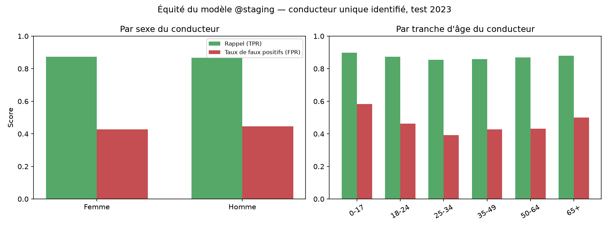

# Équité du modèle : GRAVIA

Réponds au CDC EC-6 : *« IA éthique : tests d'équité (parité selon âge/sexe, equalized odds),
documentation et atténuation des biais »*. Produit par
[`ml/fairness/audit.py`](../ml/fairness/audit.py), sur le holdout test 2023 (jamais vu à
l'entraînement, même protocole que le reste du benchmark, cf.
[ml_training_results.md](ml_training_results.md)).

## Méthodologie

Le modèle ne reçoit ni l'âge ni le sexe en feature (cf.
[`ml/features/gold_features.py`](../ml/features/gold_features.py)) : ce test vérifie que ses
prédictions ne sont pas systématiquement moins fiables pour un sous-groupe protégé malgré cela.
L'équité peut se rompre via des corrélations indirectes (type de véhicule, zone, vitesse
autorisée…) sans jamais utiliser l'attribut sensible en entrée : c'est précisément ce qu'un test
d'équité doit détecter.

**Attribut sensible retenu : le conducteur** (`catu == 1`, rubrique usagers). **Limité aux
accidents à un seul conducteur identifié**, soit 20 830 sur 54 822 accidents du test 2023 (38 %) :
la majorité des accidents impliquent plusieurs véhicules donc plusieurs conducteurs, dont le
sexe et la tranche d'âge peuvent différer, sans façon non arbitraire de n'en retenir un seul.
Retenir le conducteur le plus gravement blessé aurait biaisé le test en sélectionnant sur
l'issue même qu'on évalue (fuite méthodologique). Écarté pour cette raison. Cette limite de
portée est assumée, pas cachée : les résultats ci-dessous caractérisent le sous-ensemble
« accidents à un seul véhicule/conducteur clairement identifiable », pas l'ensemble du trafic.

Deux métriques par sous-groupe :
- **Parité démographique** : taux de prédiction « grave » par groupe (`taux_predit_grave`).
- ***Equalized odds*** : rappel/TPR (`recall`) et taux de faux positifs (`fpr`) par groupe,
  rapportés en écart absolu entre sous-groupes. **Aucun seuil pass/fail n'est imposé** :
  contrairement à PSI/recall/F1/couverture (cf. [CDC_GRAVIA.md §11](CDC_GRAVIA.md)), le CDC ne
  fixe aucun seuil numérique pour l'équité : en inventer un ici serait arbitraire, pas une
  exigence retranscrite. Les écarts sont documentés pour arbitrage, à l'image de l'angle mort
  déjà documenté du seuil unique par département ([CDC_GRAVIA.md §13.7](CDC_GRAVIA.md)).

## Résultats (2026-09-13, test 2023, 20 830 accidents à conducteur unique)

### Par sexe du conducteur

| Sexe | n | Taux grave réel | Taux prédit grave | Rappel (TPR) | FPR |
|---|---:|---:|---:|---:|---:|
| Femme | 4 884 | 0,381 | 0,597 | 0,873 | 0,427 |
| Homme | 15 259 | 0,479 | 0,648 | 0,866 | 0,446 |

*Effectifs (4 884 + 15 259 = 20 143) inférieurs aux 20 830 accidents à conducteur unique : 687
conducteurs au sexe non renseigné (`sexe = -1`) sont exclus de ce tableau.*

**Écart de rappel : 0,007 · Écart de FPR : 0,019** : parité quasi parfaite entre sexes sur les
deux métriques d'*equalized odds*. Le taux de gravité réelle diffère (hommes plus impliqués dans
des accidents graves, cohérent avec les statistiques de sécurité routière connues), mais le
modèle ne traite pas les deux groupes différemment à gravité égale.

### Par tranche d'âge du conducteur

| Tranche d'âge | n | Taux grave réel | Taux prédit grave | Rappel (TPR) | FPR |
|---|---:|---:|---:|---:|---:|
| 0-17 | 677 | 0,464 | 0,730 | 0,898 | **0,584** |
| 18-24 | 4 415 | 0,452 | 0,648 | 0,874 | 0,463 |
| 25-34 | 4 210 | 0,416 | 0,585 | 0,854 | **0,393** |
| 35-49 | 4 471 | 0,428 | 0,613 | 0,859 | 0,428 |
| 50-64 | 3 605 | 0,479 | 0,642 | 0,870 | 0,432 |
| 65+ | 2 717 | 0,539 | 0,705 | 0,880 | 0,500 |

*Effectifs (677+4 415+4 210+4 471+3 605+2 717 = 20 095) inférieurs aux 20 830 accidents à
conducteur unique : 735 conducteurs à tranche d'âge inconnue (`tranche_age = "Inconnu"`, âge
manquant ou aberrant) sont exclus de ce tableau.*

**Écart de rappel : 0,044 · Écart de FPR : 0,191.**

Le rappel reste relativement homogène (0,854 à 0,898). **La disparité se concentre sur le taux
de faux positifs** : les conducteurs mineurs (0-17, FPR = 0,584) et seniors (65+, FPR = 0,500)
sont significativement plus souvent classés « grave » à tort que les 25-34 ans (FPR = 0,393),
soit un écart de 19 points de pourcentage. Autrement dit, **parmi les accidents réellement non
graves**, le modèle sur-signale les jeunes et les seniors comme graves près d'une fois sur deux,
contre une fois sur quatre pour les 25-34 ans.



*Généré par [`docs/generate_result_charts.py`](generate_result_charts.py), recalculé contre la
stack dev réelle (`python -m docs.generate_result_charts`), pas une resaisie manuelle des
chiffres ci-dessus.*

## Interprétation et portée

- **Pas de biais discriminatoire par sexe** détecté sur ce sous-ensemble : écarts d'*equalized
  odds* inférieurs à 2 points de pourcentage sur les deux métriques.
- **Biais réel par âge, concentré sur le FPR** : cohérent avec un signal statistique plausible
  (jeunes et seniors surreprésentés dans les accidents graves en général, cf. `taux_grave_reel`
  plus élevé pour 0-17 et 65+ déjà dans les données réelles), mais le modèle **amplifie** cet
  écart au-delà du taux réel ; sur-prédire "grave" pour ces groupes n'a pas le même coût qu'un
  faux négatif (sur-priorisation de secours plutôt que sous-priorisation), mais reste une
  iniquité mesurable à ne pas ignorer.
- **Tension non résolue, à arbitrer avant production**, dans l'esprit de l'angle mort du seuil
  unique déjà documenté (CDC §13.7/§14) : corriger ce biais demanderait probablement
  un seuil de décision différencié par tranche d'âge (comme envisagé par zone géographique),
  avec le même arbitrage à faire entre équité locale et simplicité/performance globale du seuil
  unique actuel. **Non traité ici** : ce document constate et documente le biais (exigence
  CDC EC-6), l'atténuation active reste une piste future, pas un correctif appliqué au modèle
  déployé (`gravia-severity-classifier@staging`, LightGBM enriched).
- **Portée limitée aux accidents à un seul conducteur (38 % du test 2023)** : les accidents
  multi-véhicules, majoritaires, ne sont pas couverts par cette analyse (cf. Méthodologie).

## Reproduire cette analyse

```bash
docker compose -f infra/docker-compose.yml --env-file .env up -d
python -m ml.fairness.audit
```

Nécessite la stack dev démarrée (PostgreSQL pour Gold, MLflow pour le modèle `@staging`) et la
couche Silver déjà produite localement (`python -m gravia.silver`, pour le millésime 2023).
