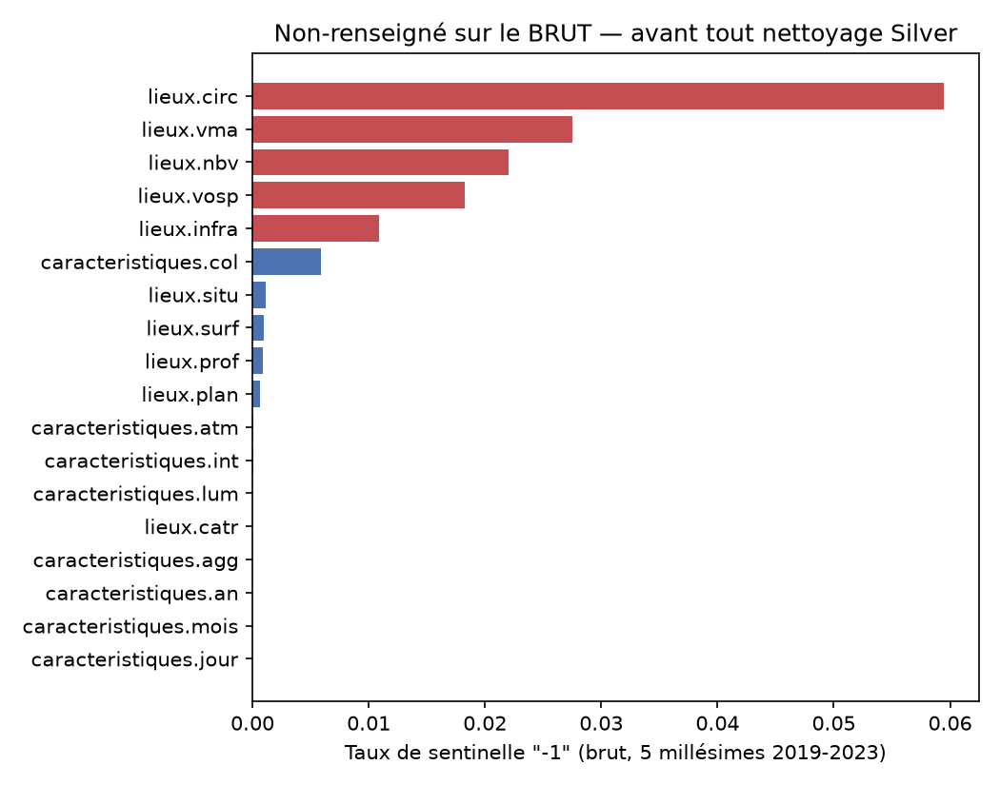
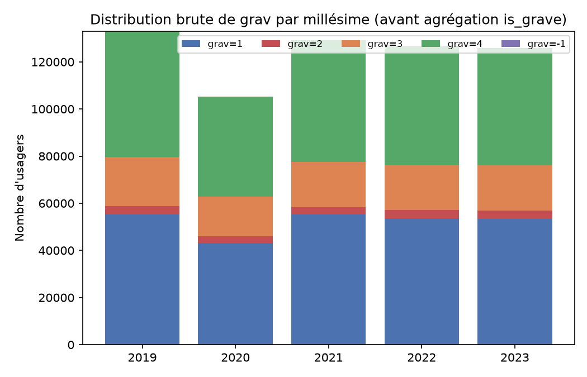
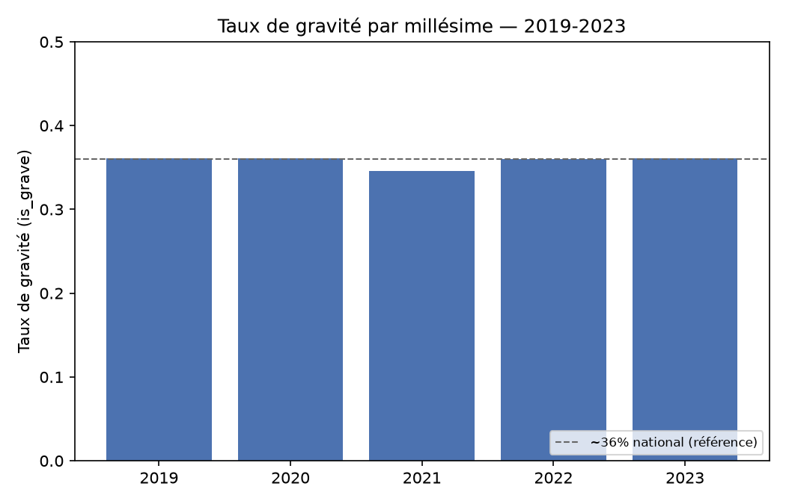
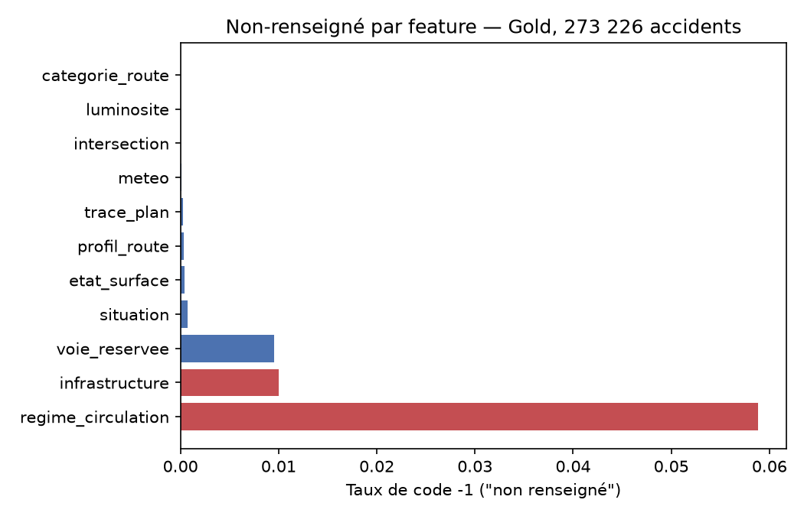
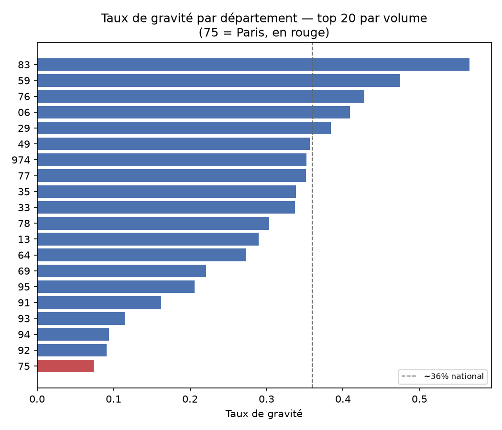
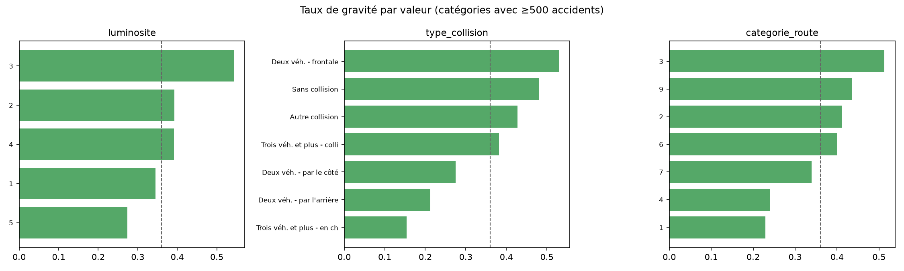

# Notebooks d'exploration : GRAVIA

Notebooks Jupyter (`.ipynb`) ayant produit les résultats et les décisions cités dans le
[CDC](../docs/CDC_GRAVIA.md) (§13.6-7), l'[architecture](../docs/Architecture_GRAVIA.md) et la
[présentation](../docs/Presentation_Projet_GRAVIA_Jedha.md) (Bloc 4).

Chaque notebook documente ses résultats dans sa cellule markdown d'en-tête et son contenu est
volontairement séparé du code de production (`ml/`, `pipelines/`) : ce sont des explorations
tracées, pas des composants de la solution. La plupart n'ont pas de visualisation (résultats
imprimés dans les cellules de sortie) ; `eda_raw_baac.ipynb` et `eda_exploration_baac.ipynb`
(§0a/§0b ci-dessous) sont l'exception : une vraie EDA visuelle, sur le brut puis sur Gold déjà
nettoyé. Seuls 3 notebooks téléchargent leurs propres données
(`explo_trafic_datex_national.ipynb`, `explo_trafic_tmja_national.ipynb`,
`explo_trafic_paris_correlation_annuel.ipynb`) ; les autres (dont `eda_baseline_baac.ipynb`,
qui porte les chiffres de référence cités dans tout le projet) lisent les CSV/Parquet BAAC
déjà présents dans `data/raw/baac/`/`data/bronze/baac/` (à produire au préalable, cf. lien CDC
pour le CSV source et `python -m gravia.bronze` pour Bronze) et échouent sinon.

## 0a. EDA sur les données BRUTES (Bronze) : audite les décisions de nettoyage

[`eda_raw_baac.ipynb`](eda_raw_baac.ipynb) : contrairement à tout le reste de ce dossier, l'EDA
classique doit précéder les décisions de nettoyage, pas seulement valider leurs résultats après
coup. Ce notebook lit Bronze (le CSV source, sans aucune transformation) pour vérifier que ce
que `gravia.silver`/`gravia.gold` ont décidé de faire correspond réellement au brut. Nécessite
les Parquet Bronze déjà produits (`python -m gravia.bronze`).

**Deux vraies trouvailles, corrigées dans le code de production (pas seulement documentées) :**
1. `lieux.nbv` contient des artefacts Excel non résolus (`#ERREUR`, `#VALEURMULTI`, 55 lignes sur
   273 226) jamais documentés avant cet audit ; ils sont traités désormais comme la sentinelle `-1`,
   pas comme un NULL silencieux (cf. `gravia.silver.NBV_EXCEL_ARTIFACTS`,
   [Architecture_GRAVIA.md §4.1](../docs/Architecture_GRAVIA.md)).
2. `grav` (usagers) : aucun code inattendu trouvé sur les 5 millésimes réels, mais l'agrégation
   `.any()` de Polars renvoie `False` (pas `null`) sur un groupe entièrement null : un accident
   dont tous les usagers auraient un `grav` illisible aurait été silencieusement classé "non
   grave" sans lever d'erreur. Jamais déclenché en pratique (vérifié ci-dessous), corrigé
   défensivement pour les millésimes futurs (cf. `gravia.gold.aggregate_usagers`).

| Graphique | Ce qu'il montre |
|---|---|
|  | Taux de `-1` par colonne codée BAAC, calculé sur le CSV source ; comparer à `eda_missingness.png` (§0b, calculé après nettoyage) |
|  | Les 5 valeurs de `grav` (1-4, -1) par millésime, avant l'agrégation en `is_grave` ; confirme l'absence de code inattendu |

## 0b. EDA exploratoire visuelle sur Gold

[`eda_exploration_baac.ipynb`](eda_exploration_baac.ipynb) : exploration visuelle sur les
features Gold déjà nettoyées/typées, pour le lien avec la cible (les décisions de nettoyage,
elles, sont auditées en §0a sur le brut). Nécessite la stack dev démarrée et Gold déjà chargé
(`python -m gravia.gold`).

| Graphique | Ce qu'il montre |
|---|---|
|  | Stabilité du taux de gravité 2019-2023 (~35-36 % chaque année) |
|  | Taux de code `-1` par feature après nettoyage ; `regime_circulation` culmine à 5,9 % |
|  | Paris (75) nettement sous la moyenne nationale ; première intuition visuelle de l'angle mort développé en §3 |
|  | Écarts réels de gravité selon la luminosité, le type de collision, la catégorie de route |

## 1. Baseline de référence

| Notebook | Question | Résultat |
|---|---|---|
| [`eda_baseline_baac.ipynb`](eda_baseline_baac.ipynb) | Que vaut un modèle sur le seul BAAC, sans enrichissement ? | **recall 0,808 / F1 macro 0,708** (holdout 2023, seuil calibré sur validation 2022) ; les deux seuils CDC sont atteints sans aucune source externe |

## 2. Enrichissement trafic : exploré puis écarté

| Notebook | Question | Résultat |
|---|---|---|
| [`explo_trafic_datex_national.ipynb`](explo_trafic_datex_national.ipynb) | Le flux DATEX II national est-il exploitable ? | Mesures propres, mais **temps réel uniquement** (pas d'archive) et table de sites décalée → jointure spatiale, 61 % des sites géolocalisables |
| [`explo_trafic_tmja_national.ipynb`](explo_trafic_tmja_national.ipynb) | Le TMJA fournit-il l'historique manquant ? | Historique réel (2007→2024) mais **~1,6 % de couverture BAAC** (réseau non concédé seulement) |
| [`explo_trafic_paris_correlation.ipynb`](explo_trafic_paris_correlation.ipynb) | Les capteurs Paris se joignent-ils au BAAC ? | **96 %** de rattachement temporel sur une semaine test ; **mais valeur réellement exploitable (débit/taux d'occupation non nuls) : ~46-53 % seulement**, corrigé dans `eval_trafic_gain_paris.ipynb` (le rattachement temporel n'est pas la couverture utile) |
| [`explo_trafic_paris_correlation_annuel.ipynb`](explo_trafic_paris_correlation_annuel.ipynb) | Le signal tient-il sur une année complète ? | Corrélation **statistiquement significative** (occupation plus faible chez les accidents graves, Welch p≈0,03) |
| [`eval_trafic_gain_paris.ipynb`](eval_trafic_gain_paris.ipynb) | Ce signal améliore-t-il un modèle dédié Paris ? | **Non** : recall +0,007, F1 macro −0,013 |
| [`eval_trafic_gain_national.ipynb`](eval_trafic_gain_national.ipynb) | Et en feature sparse sur le modèle national (config prod) ? | **Non** : recall +0,001, F1 −0,000 |

→ **Décision : trafic écarté comme feature du modèle** (signal réel mais redondant avec les
variables temporelles déjà présentes). Le flux temps réel reste ingéré pour sa valeur
opérationnelle propre (routage des secours), cf. Architecture §2.1.

## 3. Angle mort de sécurité et calibration des seuils

| Notebook | Question | Résultat |
|---|---|---|
| [`eval_seuil_par_zone.ipynb`](eval_seuil_par_zone.ipynb) | Un seuil unique est-il sûr partout ? | **Non** : recall **0,007** sur Paris malgré 0,808 au national. Seuils par département → recall Paris 0,777 mais **F1 macro national 0,573** (sous le seuil CDC) |
| [`eval_enrichissement_vs_seuil.ipynb`](eval_enrichissement_vs_seuil.ipynb) | Enrichir les features corrige-t-il la tension ? | Meilleure configuration : enrichissement (2-roues / poids lourd / piéton) **+** seuils par département → recall Paris **0,812**, F1 macro **0,609**. Tension **atténuée, pas résolue** |

→ **Point ouvert documenté** (CDC §13.7, §14) : recall ≥ 0,80 par sous-groupe et F1 macro ≥ 0,70
global ne sont pas simultanément atteignables par simple calibration de seuil. À arbitrer avant
mise en production.

## Prérequis

```bash
python -m venv .venv && .venv/Scripts/pip install -e ".[dev]"
```

Les notebooks trafic Paris nécessitent d'extraire au préalable les archives annuelles dans
`data/raw/trafic_paris/<année>_full/` ; elles sont compressées en **Deflate64**, que le module
`zipfile` de Python ne sait pas lire : utiliser `unzip` (Info-ZIP).

Un kernel Jupyter nommé `gravia` doit être enregistré une fois pour l'environnement virtuel :

```bash
.venv/Scripts/python -m ipykernel install --user --name gravia --display-name "Python (gravia)"
```

Pour exécuter un notebook depuis la ligne de commande, utiliser
[`run_notebook.py`](run_notebook.py) plutôt que `jupyter nbconvert --execute` directement :
ce dernier n'hérite pas de façon fiable du cwd du shell appelant pour le kernel, ce qui casse
l'import de `ml.*` (non installé comme package) selon d'où la commande est lancée.

```bash
.venv/Scripts/python notebooks/run_notebook.py notebooks/<fichier>.ipynb
```
